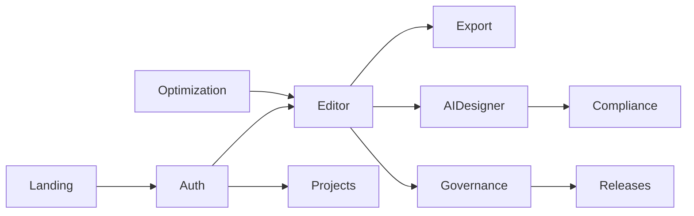

# Vishvakarma.OS — Software Inventory

**Document type:** Technical inventory and valuation scope reference  
**Product version:** v1.2.0  
**Codebase audit date:** 2026-06-12  
**Production URL:** [vishvakarma-os.vercel.app](https://vishvakarma-os.vercel.app)

This document is the authoritative record of what has been built in Vishvakarma.OS. It is intended for investors, acquirers, technical due diligence, and valuation discussions. Claims are tied to file paths, test counts, and shipped artifacts in the repository.

Related documents:

- [PRODUCT_CAPABILITIES.md](./PRODUCT_CAPABILITIES.md) — feature marketing brief
- [release/PRODUCTION_READINESS.md](./release/PRODUCTION_READINESS.md) — launch checklist
- [specs/](./specs/) — architecture and domain specifications

---

## 1. Executive Summary

Vishvakarma.OS is an iPad-first, browser-native architectural workstation delivered as a single-page application (SPA). It combines a 2D blueprint editor, a live 3D visualization chamber, AI-assisted design generation, multi-objective design optimization, building-code compliance checking, cost intelligence, and an embedded **Governance Operating System** for specification control, change management, release gating, and audit logging.

Unlike typical AEC (Architecture, Engineering, Construction) tools that ship one capability per product, Vishvakarma.OS integrates six product-class capabilities into one deployable application:

1. CAD-lite 2D drafting with parametric openings and multi-mode workspaces  
2. BIM-lite live 2D→3D sync with materials, solar lighting, and MEP fixtures  
3. AI architecture copilot with document ingestion and permit package export  
4. Multi-objective design optimization with cost and council scoring  
5. Rule-based compliance engine (12 rules across NCC, zoning, fire, energy, accessibility)  
6. Enterprise-style governance OS (specs, registry, change requests, releases, audit)

The application is production-deployed on Vercel, monetized via Stripe subscriptions, and backed by a dual-cloud persistence layer (Supabase or Firebase, runtime-selectable).

### Scope at a Glance

| Metric | Value | Source |
|--------|------:|--------|
| TypeScript/TSX files in `src/` | 514 | Glob audit 2026-06-12 |
| Production source files (excl. tests) | ~413 | 514 − 101 test files |
| Application routes (pricing enabled) | 16 | `src/routes.tsx` |
| Private (authenticated) routes | 10 | `src/routes.tsx` |
| Vercel serverless API endpoints | 5 | `api/stripe/*`, `api/ai/*` |
| Vitest test files / documented cases | 101 / 461 | `src/**/*.test.{ts,tsx}`, README |
| Playwright E2E spec files / documented cases | 19 / ~60 | `e2e/*.spec.ts`, README |
| Total test files | 120 | Vitest + Playwright |
| CI release gates | 13 | `scripts/verify-all.js` |
| Quality gate scripts | 8 | `scripts/quality/` |
| Ops/verify scripts | 47 | `scripts/` |
| Documentation files in `docs/` | 78 | Glob audit 2026-06-12 |
| Editor UI component files | 48 | `src/components/editor/` |
| Compliance rules (implemented) | 12 | `src/rules/registry.ts` |
| Compliance rule module files | 21 | `src/rules/` |
| Sample project manifests | 6 | `public/samples/` |
| Regression anchor fixtures | 6 | `tests/anchors/` |
| npm/pnpm scripts | 59 | `package.json` |
| Billing tiers (Stripe) | 3 | Starter / Studio $499 / Enterprise $1,000 mo |

---

## 2. Product Surface — What Users Get

### 2.1 Application Routes

Routing is defined in [`src/routes.tsx`](../src/routes.tsx) and enforced by [`src/components/common/RouteGuard.tsx`](../src/components/common/RouteGuard.tsx).

#### Public routes

| Route | Page component | Purpose |
|-------|----------------|---------|
| `/` | `LandingPage.tsx` | Marketing home, workflow CTAs |
| `/features` | `FeaturesPage.tsx` | Feature catalog and interactive guides |
| `/pricing` | `PricingPage.tsx` | Stripe tier comparison (when `PRICING_PAGE_ENABLED`) |
| `/auth` | `AuthPage.tsx` | Firebase/Supabase auth — Google OAuth, email magic link |
| `/reset-password` | `ResetPasswordPage.tsx` | Redirects to `/auth` (password reset not implemented) |
| `/404` | `NotFound.tsx` | Branded 404 page |

#### Private routes (authentication required)

| Route | Page component | Purpose |
|-------|----------------|---------|
| `/editor` | `EditorPage.tsx` | Core blueprint workstation — 2D canvas, 3D viewport, AI Designer |
| `/projects` | `ProjectsPage.tsx` | Project library — cloud + local, search, archive, delete |
| `/optimization` | `OptimizationPage.tsx` | Multi-candidate design optimization dashboard |
| `/profile` | `ProfilePage.tsx` | Account, billing, Stripe checkout/portal |
| `/spec-center` | `SpecCenterPage.tsx` | Locked specifications with SHA-256 hash verification |
| `/registry` | `RegistryPage.tsx` | Component, feature, and tool registry |
| `/change-requests` | `ChangeRequestsPage.tsx` | Change management — approve, reject, implement |
| `/releases` | `ReleasesPage.tsx` | Release Center — 13 release gates, evidence packs |
| `/world-records` | `WorldRecordsPage.tsx` | World Record Registry with measurement evidence |
| `/audit` | `AuditLogPage.tsx` | System audit trail timeline |

A catch-all route renders `NotFound.tsx` for unmatched paths.

### 2.2 Primary User Journeys

**Acquisition:** Landing → Features → Pricing → Auth  
**Design:** Auth → Projects → Editor → Export (JSON/PNG/PDF/DXF/SVG)  
**AI-assisted design:** Editor → AI Designer → upload docs → generate → compliance report → permit ZIP  
**Optimization:** Optimization intake → candidate comparison → promote winner to editor  
**Governance:** Spec Center → Change Requests → Releases → Audit Log

### 2.3 Serverless API Endpoints

| Endpoint | File | Auth | Purpose |
|----------|------|------|---------|
| `POST /api/stripe/create-checkout-session` | `api/stripe/create-checkout-session.ts` | Bearer JWT | Stripe Checkout for Studio/Enterprise |
| `POST /api/stripe/create-portal-session` | `api/stripe/create-portal-session.ts` | Bearer JWT | Stripe Customer Portal |
| `POST /api/stripe/webhook` | `api/stripe/webhook.ts` | Stripe signature | Subscription lifecycle webhooks |
| `POST /api/ai/parse-site-documents` | `api/ai/parse-site-documents.ts` | Server key | Gemini + local parsers for site docs |
| `POST /api/ai/extract-requirements` | `api/ai/extract-requirements.ts` | Server key | Gemini JSON requirement extraction |

Shared server libraries live in `api/_lib/` (billing backends, token verification, Stripe client, Firebase Admin).

### 2.4 Standalone Collab Server

| Service | Command | File |
|---------|---------|------|
| WebSocket presence | `pnpm run collab:server` | `server/collab/presenceServer.ts` |

Yjs CRDT sync with Firebase ID token verification and project ownership checks. Marked as preview in product.

---

## 3. Core Product Modules

Each module below is implemented in the codebase with identifiable source files. Status reflects current shipping state.

### A. 2D Blueprint Editor

**Status:** Production

| Capability | Implementation |
|------------|----------------|
| Interactive canvas | `src/components/editor/BlueprintCanvas.tsx` (~779 lines) |
| Floor plan engine | `src/core/floorPlanEngine.ts` — 50-state undo/redo |
| Tool rail | `src/components/editor/ToolRail.tsx`, `src/editor/toolMeta.ts` |
| Workspace modes | draft, MEP, interior, landscape, walk — `EditorTopBar.tsx` |

**Drawing tools (12+):**

| Tool | Shortcut | Notes |
|------|----------|-------|
| Select | V | Inspect, drag openings and furniture |
| Wall | W | Tap start, tap end |
| Door / Window | D / N | Snap to walls, parametric drag |
| Measure | M | Distance measurement |
| Label | T | Editable text labels |
| Dimension | ⇧M | Leader lines; ⇧D toggles visibility |
| Room | — | Enclosed-space detection |
| MEP | — | Outlets, switches, HVAC, lighting fixtures |
| Furniture | F | Drag reposition |
| Landscape | — | Landscape elements |
| Vastu | — | 8-direction harmony overlay |

**Additional editor capabilities:**

- Snap-to-grid and gold endpoint snap ring for wall joins  
- Room area via Shoelace formula (`src/utils/roomCalculations.ts`)  
- Local draft recovery (`src/editor/localDraft.ts`)  
- Cloud save via dual backend (`src/db/api.ts`)  
- Multi-floor scaffold (`manifest.floors[]`, v2.0 preview)  
- Onboarding overlay, sample picker, import/export dialogs  
- Command palette navigation (`src/components/workspace/WorkspaceCommandPalette.tsx`)

**Editor subsystem file count:** 48 files in `src/components/editor/`

### B. Live 3D Viewport

**Status:** Production

| Capability | Implementation |
|------------|----------------|
| 3D rendering | `src/components/editor/Viewport3D.tsx` (~721 lines) |
| Stack | React Three Fiber, Three.js, @react-three/drei |
| Sync | Real-time 2D manifest → 3D wall extrusion |
| Solar timeline | `SolarTimeline.tsx` — azimuth, elevation, intensity |
| Materials | Presets + custom textures via `CustomMaterialDialog.tsx` |
| MEP lights | Point/spot/ceiling fixtures from `manifest.fixtures[]` |
| Resilience | WebGL pre-flight + `WebGLErrorBoundary` — 2D remains usable if 3D fails |

Atmosphere modes: standard, premium, cinematic.

### C. Export Pipeline

**Status:** Production

| Format | Content | Implementation |
|--------|---------|----------------|
| JSON | Full `ProjectManifest` round-trip | `src/modules/export.ts` |
| SVG | Vector floor plan | `src/core/exporters/floorPlanSvg.ts` |
| PNG | Rasterized plan | Shared SVG builder |
| PDF | Visual floor plan + title block (A4/Letter) | `src/core/exporters/` |
| DXF | Basic LINE entities | `src/core/exporters/` |

**Governance integration:**

- Compliance-gated export: `src/services/compliance/complianceGate.ts`  
- Permit package ZIP: `src/modules/permit/permitPackageExport.ts` — cover sheet, site plan, floor plan, schedules, materials, cost, compliance report

### D. AI Architecture Copilot

**Status:** Built (Google Gemini API)

| Stage | Component / file |
|-------|------------------|
| Wizard shell | `src/components/editor/ai-designer/AIDesignerDialog.tsx` (~561 lines) |
| Upload | `CopilotUploadStep.tsx` — site survey, boundary DXF/PDF, council docs |
| Review | `CopilotReviewStep.tsx` — parsed setbacks, coverage, requirements |
| Results | `AIDesignerResultsPanel.tsx` — Concept, Site, Schedules, Materials, Cost, Compliance tabs |
| Server parsing | `api/ai/parse-site-documents.ts`, `api/ai/extract-requirements.ts` |

**Pipeline (client-side orchestration):**

| Stage | Location |
|-------|----------|
| Document ingestion | `src/services/copilot/ingestion/` — DXF boundary parser, document parsers |
| Layout solver | `src/ai/building-designer/generators/layoutSolver.ts` |
| Constraint engine | `src/ai/building-designer/generators/constraintEngine.ts` |
| Floorplan generation | `src/services/floorplan-generation/orchestrator.ts` |
| Planning shortlist | `src/planning/` — candidate generator, scoring engine, web worker |
| Council scoring | Integrated via `src/services/council-intelligence/councilEngine.ts` |

Pipeline stages: ingesting → extracting → constraints → concept → layout → floorplan → schedules → compliance → complete.

### E. Design Optimization Engine

**Status:** Built (prototype disclaimer on UI)

| Capability | Implementation |
|------------|----------------|
| Module entry | `src/modules/optimization/optimizationModule.ts` |
| Orchestrator | `src/services/optimization/optimizationOrchestrator.ts` |
| Intake form | `src/components/optimization/OptimizationIntakeForm.tsx` |
| Dashboard | `src/components/optimization/OptimizationDashboard.tsx` |

**Strategy profiles (5):** family, budget, energy, premium, resale — `src/services/optimization/strategyProfiles.ts`

**Scoring dimensions (8+):**

| Scorer | File |
|--------|------|
| Compliance | `scoring/complianceScorer.ts` |
| Cost | `scoring/costScorer.ts` |
| Energy | `scoring/energyScorer.ts` |
| Circulation | `scoring/circulationScorer.ts` |
| Privacy | `scoring/privacyScorer.ts` |
| Natural light | `scoring/naturalLightScorer.ts` |
| Buildability | `scoring/buildabilityScorer.ts` |
| Resale | `scoring/resaleScorer.ts` |

**Analysis engines:**

- Tradeoff analyzer (`tradeoffAnalyzer.ts`)  
- Moat gain analyzer (`moatGainAnalyzer.ts`)  
- Budget optimizer (`budgetOptimizer.ts`)  
- Site fitness including setback utilization (`siteFitness.ts`)

**Outputs:** Winner promotion to editor, PDF optimization report, permit package ZIP, batch history persisted to cloud.

**Optimization UI:** ~20 component files in `src/components/optimization/` including radar, bar, and tradeoff delta charts (Recharts).

### F. Compliance Engine

**Status:** Built (Australian NCC stubs; prototype disclaimer on UI)

**12 rules** registered in `src/rules/registry.ts`:

| Category | Rule ID | File |
|----------|---------|------|
| NCC | Bedroom size | `rules/ncc/bedroomSizeRule.ts` |
| NCC | Bedroom egress | `rules/ncc/bedroomEgressRule.ts` |
| NCC | Habitable room height | `rules/ncc/habitableRoomHeightRule.ts` |
| Accessibility | Door width | `rules/accessibility/doorWidthRule.ts` |
| Accessibility | Circulation width | `rules/accessibility/circulationWidthRule.ts` |
| Energy | Glazing ratio | `rules/energy/glazingRatioRule.ts` |
| Energy | Thermal comfort | `rules/energy/thermalComfortRule.ts` |
| Zoning | Setbacks | `rules/zoning/setbackRule.ts` |
| Zoning | Coverage | `rules/zoning/coverageRule.ts` |
| Zoning | Council conditions | `rules/zoning/councilConditionsRule.ts` |
| Fire | Egress path | `rules/fire/egressPathRule.ts` |
| Fire | Smoke alarm zones | `rules/fire/smokeAlarmZoneRule.ts` |

**Orchestration:**

- Module runner: `src/modules/compliance/complianceModule.ts`  
- Aggregator: `src/services/compliance/complianceAggregator.ts`  
- Export gate: `src/services/compliance/complianceGate.ts` — blocks export on failure  
- PDF report: `src/modules/compliance/complianceReportExport.ts`  
- Editor UI: `CompliancePanel.tsx`, `ComplianceBanner.tsx`

Setback rule validates building footprint against parcel boundary; requires site plan from AI Designer when applicable.

### G. Cost Intelligence

**Status:** Built

| Component | Location |
|-----------|----------|
| Orchestrator | `src/services/cost-estimation/costIntelligenceOrchestrator.ts` |
| Material database | `src/services/cost-estimation/materialDatabase.ts` |
| Material catalog | `src/data/cost/materialCatalog.ts` |
| Regional indices | `src/data/cost/regionalIndices.ts` |
| Labor rates | `src/data/cost/laborRates.ts` |
| Supplier pricing | `src/services/cost-estimation/supplierPricingEngine.ts` |
| Cost confidence | `src/services/cost-estimation/costConfidenceScorer.ts` |
| Risk analysis | `src/services/cost-estimation/costRiskAnalyzer.ts` |
| Moat analysis | `src/services/cost-estimation/costMoatAnalyzer.ts` |

Integrated into AI Designer results and Optimization dashboards (`CostIntelligencePanel.tsx`, `CostScenarioChart.tsx`).

### H. Council Intelligence

**Status:** Built

| Component | Location |
|-----------|----------|
| Council engine | `src/services/council-intelligence/councilEngine.ts` |
| Module | `src/modules/council-intelligence/councilIntelligenceModule.ts` |
| Requirement parsing | `src/domain/copilot/councilRequirements.ts` |

Parses front/side/rear setbacks and max coverage from uploaded council documents. Scores council approval likelihood for optimization candidates and planning shortlists.

### I. Governance Operating System

**Status:** Production

This subsystem is uncommon in consumer AEC tools and represents a distinct product surface.

| Page | Route | Capability |
|------|-------|------------|
| Spec Center | `/spec-center` | Locked specs with SHA-256 hash verification |
| Registry | `/registry` | CRUD for components, features, tools |
| Change Requests | `/change-requests` | Create, approve, reject, implement workflow |
| Release Center | `/releases` | 13 automated release gates, evidence pack download |
| World Records | `/world-records` | Self-verified metric registry |
| Audit Log | `/audit` | Immutable timeline (200-entry cap in UI) |

**Core governance logic:**

| Component | File |
|-----------|------|
| Runtime enforcer | `src/governance/core/enforcer.ts` |
| Spec hashing | `src/governance/core/specHash.ts` |
| Snapshot manager | `src/governance/snapshots/snapshotManager.ts` — hash-chain snapshots |
| Release gate manifest | `src/governance/gates/releaseGateManifest.ts` |
| Gate UI status | `src/governance/gates/gate-ui-status.json` |

Governance is integrated at save and export via `src/modules/export.ts`. All CRUD operations emit audit log entries through `src/db/api.ts`.

**13 release gates** (via `pnpm run release:gates`): spec validation, data model, security, build verification, E2E, accessibility, world record metrics, and related checks documented in `scripts/verify-all.js`.

### J. Simulations and Domain Tools

**Status:** Mixed — Vastu production; others CPU preview scaffolds

| Simulation | File | Status |
|------------|------|--------|
| Vastu harmony (8-direction) | `src/core/simulations/vastu.ts` | Built |
| Tvashtar MEP routing | `src/core/simulations/tvashtar.ts` | Preview scaffold |
| Agni thermal | `src/core/simulations/thermalEngine.ts` | Preview scaffold |
| Vayu CFD / ventilation | `src/core/simulations/vayuCFD.ts` | Preview scaffold |
| Lot analysis | `src/services/lot-analysis/lotAnalysis.ts` | Built |
| Zoning resolution | `src/services/zoning/resolveZoning.ts` | Built |

Editor panels for Panchatattva and Akasha Cast are marked "coming soon" in `SimulationPanels.tsx`.

### K. Collaboration

**Status:** Preview scaffold

| Component | File |
|-----------|------|
| Yjs CRDT sync | `src/collaboration/` |
| WebSocket provider | `src/collaboration/yjsProvider.ts` |
| Remote cursors | `src/components/editor/collaboration/RemoteCursorsOverlay.tsx` |
| Collaboration bar | `EditorCollaborationBar.tsx` |
| Presence server | `server/collab/presenceServer.ts` |

Enterprise tier lists collaboration as planned. Features page marks real-time collaboration as preview.

### L. Marketing and Monetization Surfaces

**Status:** Production

| Surface | File |
|---------|------|
| Landing page | `src/pages/LandingPage.tsx` |
| Features page | `src/pages/FeaturesPage.tsx` — 6 interactive guides, 10 feature modules |
| Pricing page | `src/pages/PricingPage.tsx` |
| Sacred visual layers | `src/components/marketing/SacredMandalaLayer.tsx`, `SacredCosmicLayer.tsx` |
| Billing banner | `src/components/billing/BillingBanner.tsx` |
| Plan configuration | `src/config/billingPlans.ts` |

---

## 4. Platform and Infrastructure

### 4.1 Technology Stack

| Layer | Technology |
|-------|------------|
| UI framework | React 18, React Router 7 |
| Build | Vite (rolldown-vite 7), TypeScript 5.9 |
| Styling | Tailwind CSS 3, custom workstation design tokens |
| Component library | Radix UI (shadcn-style, 50+ components in `src/components/ui/`) |
| 3D | Three.js 0.180, @react-three/fiber, @react-three/drei |
| Forms / validation | react-hook-form, Zod |
| Charts | Recharts |
| Realtime | Yjs, y-websocket, y-indexeddb |
| AI | @google/generative-ai (Gemini) |
| Billing | Stripe SDK v22 |
| Package manager | pnpm 9.15 |
| Node | ≥20 |

### 4.2 Dual-Backend Architecture

The application implements **full parallel backends** selectable at runtime via `VITE_BACKEND_PROVIDER` (`src/backend/backendConfig.ts`). A unified facade at `src/db/api.ts` (~358 lines) routes all persistence.

| Concern | Firebase | Supabase |
|---------|----------|----------|
| Auth | `src/backend/firebase/firebaseAuthGateway.ts` | `src/backend/supabase/supabaseAuthGateway.ts` |
| OAuth (Google, Apple) | `firebaseOAuthGateway.ts` | `supabaseOAuthGateway.ts` |
| Projects | `firestoreProjectGateway.ts` | `supabaseProjectGateway.ts` |
| Governance | `firestoreGovernanceGateway.ts` | `supabaseGovernanceGateway.ts` |
| Optimization batches | `firestoreOptimizationGateway.ts` | `supabaseOptimizationGateway.ts` |
| Billing | `firestoreBillingGateway.ts` | `supabaseBillingGateway.ts` |
| Profiles | `firestoreProfileGateway.ts` | `supabaseProfileGateway.ts` |

**Supabase Postgres schema** — 4 migrations in `supabase/migrations/`:

1. Core tables: profiles, projects, specs, registry, change_requests, releases, audit_logs, route_manifest  
2. Auth trigger: auto-create profile on signup  
3. RLS policies: uid-scoped access + admin via `profiles.role`  
4. Billing and optimization batch tables

**Firebase** — Firestore rules, indexes, Storage for custom material textures, Realtime Database rules for collab paths. Firebase project: `gen-lang-client-0690161780`.

**Local fallback:** When backend is unconfigured, projects and drafts persist to `localStorage` with full editor functionality.

**Migration tooling:** `scripts/migration/export-supabase.mjs`, `import-firestore.mjs`, `validate-migration.mjs` — documented in [MIGRATION.md](../MIGRATION.md).

### 4.3 Authentication

| Method | Providers |
|--------|-----------|
| Passwordless email link | Firebase and Supabase |
| Google OAuth | Firebase and Supabase |
| Apple OAuth | Firebase and Supabase |

Route guard protects 10 private routes. Production OAuth is verified in CI (`.github/workflows/verify.yml` — live Google OAuth job across Chromium, Firefox, WebKit).

Auth capabilities manifest: `public/auth-capabilities.json` via `src/backend/authCapabilities.ts`.

### 4.4 Monetization (Stripe)

Plans defined in `src/config/billingPlans.ts`:

| Tier | Price | Checkout | Trial |
|------|-------|----------|-------|
| Starter | Free | No | — |
| Studio | $499/month | Self-serve Stripe Checkout | 14 days |
| Enterprise | $1,000/month | Self-serve | None |

**Stripe integration depth:**

- Checkout session creation (`api/stripe/create-checkout-session.ts`)  
- Customer Portal (`api/stripe/create-portal-session.ts`)  
- Webhook handler: checkout completed, subscription updated/deleted, payment failed  
- Tier-based export gating via `resolveExportTier()`  
- Co-owner enterprise bypass: `src/config/coOwners.ts`  
- Setup script: `scripts/setup-stripe-products.mjs`  
- Verification: `scripts/verify-stripe-billing.mjs`

### 4.5 Deployment

| Platform | Configuration |
|----------|---------------|
| Vercel | SPA rewrites to `dist/`, serverless `api/` routes |
| Security | CSP, HSTS, security headers — `vercel.json`, `scripts/quality/check-vercel-security.mjs` |
| Deploy script | `scripts/deploy-vercel.sh` (`pnpm run deploy:vercel`) |
| PWA assets | Apple touch icon, PNG icon generators in `scripts/` |

---

## 5. Quality Engineering and Operational Maturity

### 5.1 Test Coverage

| Layer | Files | Documented cases |
|-------|------:|-----------------:|
| Vitest unit/integration | 101 | 461 |
| Playwright E2E | 19 | ~60 |
| **Total** | **120** | **~521** |

**Coverage policy (v8):** 50% lines/functions/statements, 40% branches — enforced in CI via `pnpm run test:coverage`.

**Vitest domains tested:** Editor core, 2D/3D parity, save/load determinism, governance modules, import/export, compliance rules, optimization scoring, cost intelligence, council engine, copilot ingestion, planning pipeline, auth/billing, regression anchors, route wiring.

**Playwright E2E specs:**

| Spec | Coverage |
|------|----------|
| `auth-gate`, `auth-private-routes` | OAuth and route protection |
| `editor-features`, `ipad-editor-layout`, `ipad-production-readiness` | iPad-first editor UX |
| `compliance-gate`, `optimization`, `ai-designer` | Domain intelligence flows |
| `governance-smoke`, `workspace-navigation`, `projects-profile` | Governance and navigation |
| `collaboration-sync` | Real-time collaboration |
| `marketing-pages`, `marketing-asset-pack` | Public marketing |
| `accessibility-audit` | WCAG 2.1 AA (axe-playwright) |
| `cross-browser-smoke` | Chromium, Firefox, WebKit |
| `page-reference-pack*`, `release-screenshot-pack` | Visual regression |

**Regression anchors:** 6 gold-standard JSON fixtures in `tests/anchors/` — compliance, copilot, cost, council, optimization, system versions.

### 5.2 CI/CD Pipeline

**Primary workflow:** `.github/workflows/verify.yml`

| Job | Steps |
|-----|-------|
| verify | Lint → Vercel security → auth gates → Supabase/Firebase smoke → launch evidence → contract gates → regression anchors → test:coverage → route smoke → build → world-record artifact |
| e2e-production-auth | Live Google OAuth proof (all browsers) |
| e2e | Playwright matrix: Chromium, Firefox, WebKit |
| release-gates | `pnpm run release:gates` — 13/13 strict gates |

**Secondary workflow:** `.github/workflows/e2e.yml` — dedicated auth-gate E2E on Chromium.

### 5.3 Quality and Ops Scripts

**8 quality gate scripts** (`scripts/quality/`):

- System contract enforcement  
- Forbidden module edges  
- Build gate schema  
- Auth config guard  
- Vercel security headers  
- Launch evidence ledger  
- Flawless-use gates  
- Editor export canonical check  

**47 total scripts** including auth setup/verify, Stripe billing verify, migration, screenshot packs, world-record measurement, production evidence generation, and admin/co-owner setup.

### 5.4 Documentation Corpus

**78 files** in `docs/` including:

| Category | Examples |
|----------|----------|
| Architecture specs | `specs/ARCHITECTURE_COPILOT_v2.md`, `PLANNING_INTELLIGENCE_v1.md`, `DESIGN_OPTIMIZATION_ENGINE.md`, `CONSTRUCTION_COST_INTELLIGENCE.md`, `COUNCIL_INTELLIGENCE.md`, `SYSTEM_CONTRACT_LAYER.md` |
| Release runbooks | `release/DEPLOYMENT.md`, `VERCEL_ENV.md`, `STRIPE_SETUP.md`, `PRODUCTION_READINESS.md`, `VERIFY_COMMANDS.md` |
| Launch evidence | CI run logs, screenshot packs, auth proofs, iPad audit, security headers |
| User guides | `user/GETTING_STARTED.md`, `TOOL_REFERENCE.md`, `KEYBOARD_SHORTCUTS.md`, `FAQ.md` |
| Governance | `GOVERNANCE_QUICKSTART.md`, `GOVERNANCE_IMPLEMENTATION.md` |
| World record | `world-record/WORLD_RECORD_CLAIM.md`, measurement artifacts |
| Design references | 31 page-reference screenshots, PNG pack, OCR PDF of all pages |
| RFCs | Curved walls, DXF import, building codes |

---

## 6. Intellectual Property and Proprietary Logic

The following engines are custom-built application logic, not third-party integrations.

| Domain | Location | Scope |
|--------|----------|-------|
| Floor plan engine + exporters | `src/core/` | Engine, manifest schema, SVG/DXF/PDF/PNG export |
| Project model | `src/core/projectModel.ts`, `manifestSchema.ts` | Single source of truth schema |
| Building code rules | `src/rules/` (21 files) | 12 compliance rules + shared context |
| Optimization scoring | `src/services/optimization/` (30+ files) | 8 scorers, orchestrator, tradeoff/moat/budget analyzers |
| Planning intelligence | `src/planning/` | Candidate generation, scoring, web worker pipeline |
| AI building designer | `src/ai/building-designer/` | Layout solver, adjacency solver, constraint engine, manifest transformer |
| Floorplan generation | `src/services/floorplan-generation/` | Multi-stage orchestrator |
| Cost intelligence | `src/services/cost-estimation/`, `src/data/cost/` | Catalog, regional indices, labor, supplier pricing |
| Council intelligence | `src/services/council-intelligence/` | Approval likelihood engine |
| Copilot ingestion | `src/services/copilot/ingestion/` | DXF boundary parser, document parsers, requirement merger |
| Compliance orchestration | `src/services/compliance/`, `src/modules/compliance/` | Aggregator, gate, report export |
| Permit export | `src/modules/permit/` | ZIP package assembly |
| Governance / contract layer | `src/governance/`, `src/core-contract/` | Enforcer, spec hash, build gates, system flow schemas |
| Vastu simulation | `src/core/simulations/vastu.ts` | 8-direction harmony scoring |
| Template builder | `src/core/templateBuilder.ts` (~600 lines) | Programmatic sample project generation |
| Sample catalog | `src/core/sampleCatalog.ts` | Curated demo projects |

**System contract schemas** (`src/core-contract/`): pipeline, compliance, cost, output, build-gate — enforce architectural drift prevention at CI time.

---

## 7. Development Effort Signals

This section provides scope indicators for valuation discussions. It does **not** include speculative dollar amounts or invented hour estimates.

### 7.1 Codebase Scale

| Indicator | Value |
|-----------|------:|
| Total `src/` TypeScript/TSX files | 514 |
| Production source files (excl. tests) | ~413 |
| Editor component files | 48 |
| Optimization UI files | ~20 |
| UI design system components | 50+ |
| Core modules (`src/modules/`) | 11 |
| Application pages (`src/pages/`) | 16 |
| Serverless API + lib files | 13 |

**Large subsystem files (complexity signal):**

| File | Approx. lines |
|------|-------------:|
| `EditorPage.tsx` | 881 |
| `BlueprintCanvas.tsx` | 779 |
| `Viewport3D.tsx` | 721 |
| `AIDesignerDialog.tsx` | 561 |
| `ReleasesPage.tsx` | 481 |
| `AuthPage.tsx` | 489 |
| `templateBuilder.ts` | 600 |
| `db/api.ts` | 358 |

### 7.2 Dual-Backend Multiplier

Full parallel implementations exist for auth, projects, governance, billing, optimization, and profiles across Firebase and Supabase. Switching backends requires only environment variable changes — no code changes. This represents approximately **2× persistence and auth implementation effort** compared to a single-backend application.

### 7.3 Comparable Commercial Scope

Vishvakarma.OS combines capabilities that are typically sold as separate product lines in the AEC SaaS market:

| Capability class | Typical market equivalent |
|------------------|-------------------------|
| 2D floor plan editor | RoomSketcher, Planner 5D, Cedreo |
| Live 3D sync | HomeByMe, SketchUp viewer integrations |
| AI design from documents | Higharc, Arkify (emerging) |
| Design optimization | Internal tools at large AEC firms |
| Building code compliance | SoftPlan, regional compliance plugins |
| Permit package export | PermitFlow (workflow), plan export tools |
| Governance / traceability | Enterprise PLM, not consumer AEC |

The integrated scope spans **4–6 distinct product categories** in a single deployable SPA.

### 7.4 Operational Maturity Beyond MVP

Indicators that the codebase exceeds typical early-stage MVP quality:

- 120 test files with enforced coverage thresholds  
- 13 automated release gates with evidence manifest  
- 47 operational scripts for auth, billing, migration, and evidence  
- 78 documentation files including architecture specs and launch evidence  
- Cross-browser E2E with live production OAuth verification  
- Dual-backend migration tooling with export/import/validate scripts  
- World record measurement artifact pipeline (`pnpm run record:measure`)  
- Regression anchor gold-standard fixtures for deterministic output verification

### 7.5 Monetization Readiness

Stripe Checkout, Customer Portal, webhooks, tier-based feature gating, and co-owner entitlements are implemented and verifiable via `pnpm run verify:stripe-billing`. Published pricing: Studio at $499/month, Enterprise at $1,000/month.

---

## 8. Production Status Matrix

Honest status labeling for evaluators. Items marked "Built" have working code paths; "Production" indicates live deployment and CI verification.

| Module | Status | Notes |
|--------|--------|-------|
| 2D blueprint editor | Production | CI + E2E verified |
| Live 3D viewport | Production | 2D/3D parity tests |
| Export (JSON/SVG/PNG/PDF/DXF) | Production | Compliance-gated |
| Auth (email link, Google, Apple) | Production | Live OAuth in CI |
| Projects (cloud + local) | Production | Dual backend |
| Stripe billing | Production | Checkout, portal, webhooks |
| Governance OS (6 pages) | Production | Spec, registry, CR, releases, audit, world records |
| Marketing pages | Production | Landing, features, pricing |
| AI Designer copilot | Built | Requires `GEMINI_API_KEY` |
| Optimization engine + dashboard | Built | Prototype disclaimer on UI |
| Compliance engine (12 rules) | Built | Australian NCC stubs; prototype disclaimer |
| Cost intelligence | Built | Integrated in AI Designer and Optimization |
| Council intelligence | Built | Document parsing + scoring |
| Permit package ZIP export | Built | Test coverage present |
| Vastu harmony | Built | Editor tool + panel |
| Real-time collaboration | Preview scaffold | Yjs + WebSocket server exists |
| Password reset | Stub | Redirects to `/auth` |
| Panchatattva / Akasha Cast panels | Coming soon | UI placeholders |
| Multi-floor editing | Preview scaffold | v2.0 planned |
| SSO / SAML (Enterprise tier) | Planned | Listed in plan features |

---

## 9. External Integrations

| Service | Integration depth | Key env vars |
|---------|-------------------|--------------|
| Stripe | Checkout, portal, webhooks, tier gating | `STRIPE_SECRET_KEY`, `STRIPE_WEBHOOK_SECRET`, price IDs |
| Google Gemini | Requirements extraction, document parsing | `GEMINI_API_KEY`, `GEMINI_MODEL` |
| Firebase | Auth, Firestore, Storage, Admin SDK, Realtime DB | `VITE_FIREBASE_*` |
| Supabase | Auth, Postgres, RLS | `VITE_SUPABASE_*`, `SUPABASE_SERVICE_ROLE_KEY` |
| Vercel | Hosting, serverless API, security headers | Vercel project config |
| Three.js / R3F | 3D rendering | Bundled dependencies |
| Yjs | CRDT collaboration scaffold | `collab:server` WebSocket |
| Google / Apple OAuth | Sign-in providers | Firebase Console / Supabase dashboard |

**Monitoring:** Sentry placeholder in `src/lib/monitoring.ts` (`VITE_SENTRY_DSN`) — not wired. Analytics uses consent-gated local pattern in `src/lib/analytics.ts`.

---

## 10. Appendix

### 10.1 Sample Project Manifests

| File | Purpose |
|------|---------|
| `public/samples/sample-house-01.json` | Starter house |
| `public/samples/furniture-showcase.json` | Furniture placement demo |
| `public/samples/landscape-garden.json` | Landscape tools demo |
| `public/samples/mep-lighting-showcase.json` | MEP and lighting fixtures |
| `public/samples/full-feature-showcase.json` | Full feature demonstration |
| `public/samples/compliance-setback-fail.json` | Compliance failure scenario |

Catalog: `src/core/sampleCatalog.ts`. Generator: `scripts/generate-sample-json.mjs`.

### 10.2 Core Modules (`src/modules/`)

| Module | File | Role |
|--------|------|------|
| Canvas engine | `canvasEngine.ts` | 2D drawing primitives |
| Export | `export.ts` | Multi-format export orchestration |
| Import | `import.ts` | Project import + validation |
| Format validator | `formatValidator.ts` | Manifest schema validation |
| Compliance | `compliance/complianceModule.ts` | Rule runner |
| Optimization | `optimization/optimizationModule.ts` | Optimization entry point |
| Permit | `permit/permitPackageExport.ts` | Permit ZIP assembly |
| Council intelligence | `council-intelligence/councilIntelligenceModule.ts` | Council scoring module |
| AI designer | `ai-designer/buildingDesignerModule.ts` | AI design module |
| Governance lock | `governanceLock.ts` | Governance enforcement at save |
| Collaboration engine | `collaborationEngine.ts` | Collab state (unit-tested) |

### 10.3 Key Verification Commands

| Command | Purpose |
|---------|---------|
| `pnpm run lint` | Biome + tsgo + ast-grep |
| `pnpm run test` | 461 Vitest cases |
| `pnpm run test:coverage` | Coverage with thresholds |
| `pnpm run test:e2e` | Playwright auth-gate + app-smoke |
| `pnpm run test:e2e:cross-browser` | Chromium, Firefox, WebKit |
| `pnpm run build` | Production build → `dist/` |
| `pnpm run verify:ci` | Full CI verify pipeline |
| `pnpm run release:gates` | 13/13 release gates |
| `pnpm run verify:stripe-billing` | Stripe integration verify |
| `pnpm run verify:production-auth-flow` | Production auth flow |
| `pnpm run record:measure` | World record gate measurement |

Full operator checklist: [release/VERIFY_COMMANDS.md](./release/VERIFY_COMMANDS.md).

### 10.4 Regression Anchors

| Fixture | Domain |
|---------|--------|
| `tests/anchors/compliance-gold-standard.json` | Compliance output |
| `tests/anchors/copilot-gold-standard.json` | Copilot pipeline |
| `tests/anchors/cost-gold-standard.json` | Cost intelligence |
| `tests/anchors/council-gold-standard.json` | Council scoring |
| `tests/anchors/optimization-gold-standard.json` | Optimization scoring |
| `tests/anchors/system-versions.json` | System version contract |

Verified by `pnpm run test:anchors`.

### 10.5 Related Documentation Index

| Document | Purpose |
|----------|---------|
| [PRODUCT_CAPABILITIES.md](./PRODUCT_CAPABILITIES.md) | Audited feature brief |
| [release/PRODUCTION_READINESS.md](./release/PRODUCTION_READINESS.md) | Launch checklist |
| [release/STRIPE_SETUP.md](./release/STRIPE_SETUP.md) | Billing rollout |
| [release/VERCEL_ENV.md](./release/VERCEL_ENV.md) | Environment variable matrix |
| [specs/DESIGN_OPTIMIZATION_ENGINE.md](./specs/DESIGN_OPTIMIZATION_ENGINE.md) | Optimization spec |
| [specs/ARCHITECTURE_COPILOT_v2.md](./specs/ARCHITECTURE_COPILOT_v2.md) | AI copilot spec |
| [specs/CONSTRUCTION_COST_INTELLIGENCE.md](./specs/CONSTRUCTION_COST_INTELLIGENCE.md) | Cost intelligence spec |
| [specs/COUNCIL_INTELLIGENCE.md](./specs/COUNCIL_INTELLIGENCE.md) | Council intelligence spec |
| [world-record/WORLD_RECORD_CLAIM.md](./world-record/WORLD_RECORD_CLAIM.md) | World record evidence |
| [GOVERNANCE_IMPLEMENTATION.md](./GOVERNANCE_IMPLEMENTATION.md) | Governance OS implementation |
| [MIGRATION.md](../MIGRATION.md) | Version and backend migration |

---

## Document Maintenance

Update this inventory when:

- A new major module ships (new route, new engine, new integration)  
- Test counts change materially (re-run `pnpm run test` and update Section 1 table)  
- Production status changes (Section 8 matrix)  
- Version bumps (update header and re-audit file counts)

**Last audited:** 2026-06-12 against codebase v1.2.0 (`package.json`).
