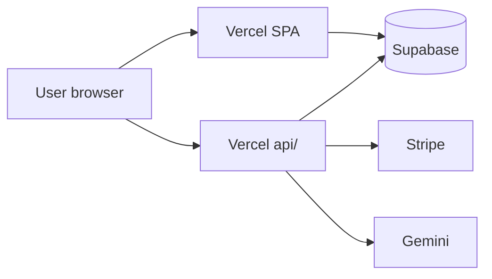

# Data Processing and Subprocessors

**Product version:** v1.5.0  
**Last verified:** 2026-06-15  
**Audience:** operator, due-diligence  

Third-party services that process data on behalf of Vishvakarma.OS.

---

## Subprocessor table

| Vendor | Service | Data processed | Location | Purpose |
|--------|---------|----------------|----------|---------|
| **Supabase** | Auth, Postgres, Storage | Account, projects, manifests, files | Configurable (project region) | Primary backend |
| **Stripe** | Payments | Email, billing metadata, payment methods | US/EU (Stripe) | Subscriptions |
| **Vercel** | Hosting, serverless | HTTP logs, function payloads in transit | Global edge | App delivery, API routes |
| **Google (Gemini)** | Generative AI | Prompts, parsed documents (when AI enabled) | Google cloud | Copilot parsing |
| **Sentry** (optional) | Error monitoring | Error events, stripped breadcrumbs | Sentry region | Reliability |
| **GitHub** | Source control | Code (no end-user PII in repo) | US | Development |

---

## Data flows

---

## Operator responsibilities

1. Execute Data Processing Agreements with vendors where required
2. Document Supabase project region in operator annex
3. Restrict service role keys to server-side Vercel functions only
4. Rotate keys on operator transfer — [operations/ACCOUNT_TRANSFER.md](../operations/ACCOUNT_TRANSFER.md)

---

## Legacy Firebase

Firebase is **not** a production subprocessor. Legacy migration scripts may read archived Firebase exports locally — see [MIGRATION.md](../../MIGRATION.md).

---

## Related

- [PRIVACY.md](./PRIVACY.md)
- [handoff/07-integrations-and-accounts.md](../handoff/07-integrations-and-accounts.md)
