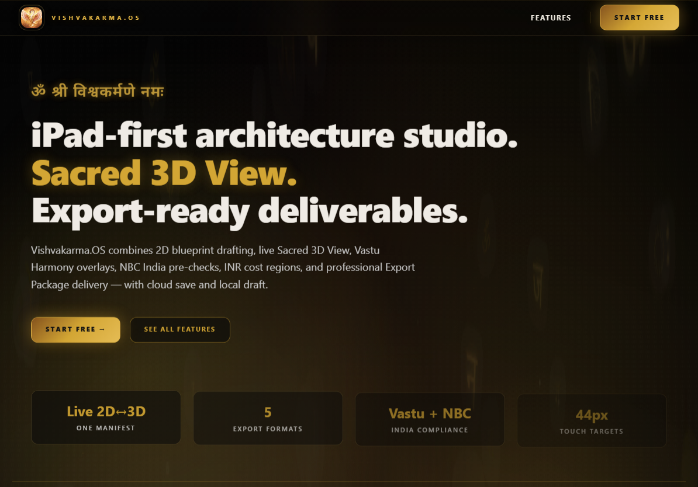
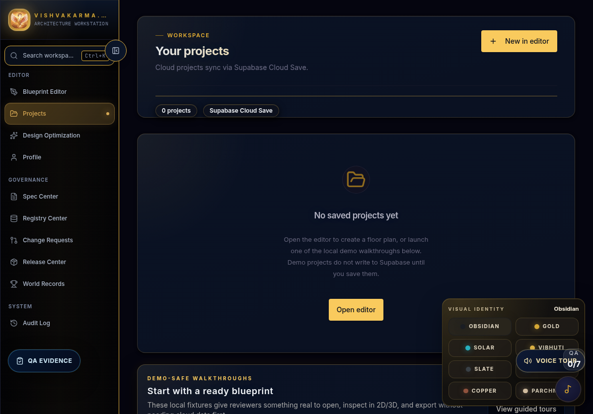
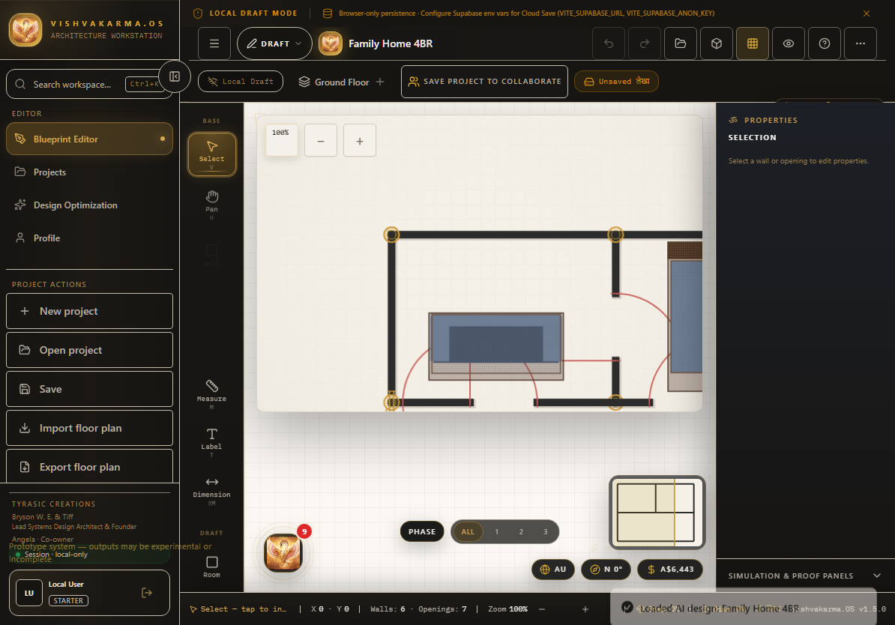
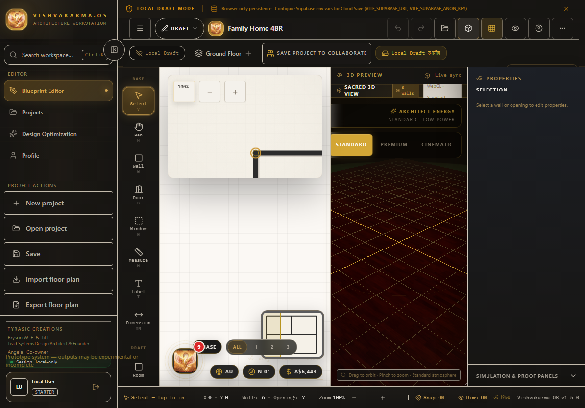
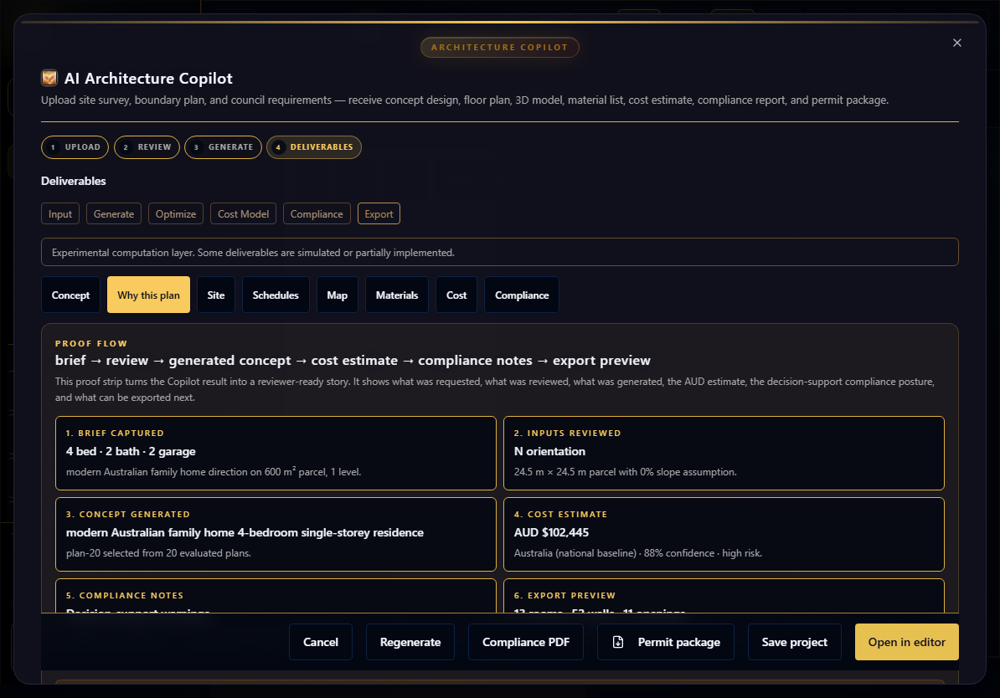
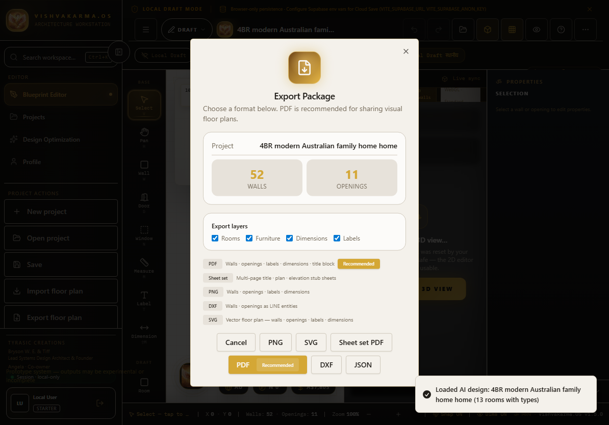

# Vishvakarma.OS — Investor / Demo Screenshot Pack

**Purpose:** Turn the committed demo screenshots into a lightweight investor, acquisition-listing, and pilot-demo pack.

**Core walkthrough:** Problem → Product → Demo flow → AI proof → Export preview → Market use → AUD value → Next pilot.

**Truth rule:** Vishvakarma.OS is concept-design and decision-support software. Do not present it as certified engineering, guaranteed council approval, a complete CAD/BIM replacement, or a fixed construction quote tool.

---

## 1. Problem

Residential building ideas are expensive to explain badly.

Homeowners, families, builders, and early-stage designers often need to answer simple questions before they spend serious money:

- What does the idea look like as a floor plan?
- Can a non-technical person understand it visually?
- Can the idea be reviewed in 3D before formal drafting?
- What is the rough cost direction?
- Are there obvious compliance or planning issues to discuss early?
- Can the concept be packaged for review without manually rebuilding evidence every time?

Most workflows jump too quickly from conversation to expensive drafting, or they scatter the evidence across screenshots, PDFs, notes, and separate tools.

**Vishvakarma.OS solves the early understanding problem.**

---

## 2. Product

Vishvakarma.OS is a browser-native architecture workstation for early residential concept design and review.

It combines:

- Ready demo/project entry points.
- A 2D blueprint editor.
- A 3D visual review path.
- AI Architecture Copilot proof flow.
- AUD cost estimate presentation.
- Decision-support compliance notes.
- Export-preview and media-evidence workflow.

This is strongest as a **pilot-ready architecture demo/product surface**, not as a certified approval system.



**Screenshot proof:** Landing page shows the product brand and first-impression architecture workstation story.

---

## 3. Demo flow

The strongest demo path is:

```text
Landing → Projects demo card → Editor → 2D/3D → AI Copilot proof flow → Export preview
```

The Projects page gives reviewers ready blueprints instead of an empty app. This makes the product easier to understand in the first 30 seconds.



**Demo message:** “A reviewer can open a ready blueprint without creating cloud data first.”

---

## 4. 2D blueprint proof

The editor proves that the product is more than a static landing page. It has a real workspace where a user can inspect an actual blueprint.



**Demo message:** “The idea becomes a plan that can be inspected, discussed, and exported.”

Useful audience:

- Homeowner reviewing a layout.
- Builder explaining a concept.
- Designer checking spatial arrangement.
- Investor validating that a real product surface exists.

---

## 5. 3D visual review

The 3D preview helps non-technical people understand the space quickly. This matters because most customers do not think in plan symbols first — they understand space visually.



**Demo message:** “The same blueprint can be reviewed visually, reducing confusion before formal decisions.”

---

## 6. AI proof

The AI Architecture Copilot proof flow turns the AI result into a reviewer-ready story:

```text
brief → review → generated concept → cost estimate → compliance notes → export preview
```



The proof flow is designed to show:

- What the user asked for.
- What inputs were reviewed.
- What concept was generated.
- What the rough AUD estimate is.
- What compliance posture should be discussed.
- What export path exists next.

**Important wording:** cost and compliance are decision-support outputs only. They are not fixed construction quotes or certified approvals.

---

## 7. Export preview

The export preview gives the product a handoff story. It is not only a canvas — it can move toward a package, PDF, permit-style bundle, or demo evidence output.



**Demo message:** “The concept can move from visual review into packaged outputs.”

---

## 8. Market use

### Primary market fit

Vishvakarma.OS is most useful for early-stage residential concept review:

- Homeowner design discussions.
- Builder/designer pre-consult demos.
- Family layout comparisons.
- Pilot architecture workflows.
- Sales demos for design services.
- Listing/acquisition product evidence.

### Best first pilot

A practical first pilot would be:

- 3–5 residential concept demos.
- 2-minute walkthrough per concept.
- Screenshot pack generated per concept.
- Feedback collected from homeowner/builder/designer.
- Record: clarity, time saved, confusion reduced, and willingness to pay.

### What not to claim

Do not position this as:

- Certified engineering.
- Guaranteed council approval.
- Complete CAD/BIM replacement.
- Fixed-price construction quoting.
- Automated legal compliance sign-off.

---

## 9. AUD value frame

These are internal/demo valuation frames, not guaranteed sale prices.

| Value category | AUD range | Why |
|---|---:|---|
| Current software asset value | $75k–$260k AUD | Built product surface, editor, 3D path, AI proof flow, export/media evidence, and green deployment. |
| Replacement build value | $300k–$850k+ AUD | Rebuilding the editor, AI flow, proof system, test harness, screenshots, docs, and deployment layer would require serious engineering/design time. |
| Demo/pilot value | $180k–$400k AUD | Strong enough to show buyers, pilot partners, or investors as a working concept-design workstation. |
| Future upside with users/revenue | $500k–$1.5M+ AUD potential | Depends on pilots, paying users, conversion, reliability, and evidence from real workflows. |

**Honest investor wording:**

> Vishvakarma.OS is a built demo/pilot product, not just an idea. The current value is strongest in the working product surface, evidence pipeline, and repeatable demo path. The next valuation jump comes from real pilots, testimonials, usage metrics, and revenue.

---

## 10. Next pilot plan

### Goal

Prove that Vishvakarma.OS helps someone understand a residential design idea faster and with less confusion.

### Pilot workflow

1. Pick one simple residential brief.
2. Open a ready blueprint or generate a concept.
3. Show 2D plan.
4. Show 3D preview.
5. Show AI proof flow.
6. Show AUD estimate and decision-support compliance notes.
7. Show export preview.
8. Ask the reviewer what became clearer.

### Metrics to collect

- Time to understand the plan.
- Number of questions/confusions before and after 3D preview.
- Whether the AUD estimate helped the conversation.
- Whether compliance notes helped identify early risks.
- Whether the reviewer would pay for a concept review.
- Whether a builder/designer would use this in a consult.

### Pilot success condition

A pilot is promising if reviewers say:

- “I understand the design faster.”
- “The 3D view helped.”
- “The AI summary made the concept easier to explain.”
- “The estimate/compliance notes are useful as early guidance.”
- “I would use or pay for this before formal drafting.”

---

## 11. 60-second investor narration

> Vishvakarma.OS is a browser-native architecture workstation for early residential concept design. The problem is that building ideas are expensive and confusing to explain before formal drafting. Here, a reviewer can open a ready demo blueprint, inspect it in 2D, preview it in 3D, and use an AI Copilot proof flow to show the brief, reviewed inputs, generated concept, AUD estimate, decision-support compliance notes, and export preview. It is not certified approval software; it is a pilot-ready concept review platform. The next value jump comes from residential pilots, proof videos, and paying users.

---

## 12. Use this pack for

- Investor deck screenshots.
- Flippa/acquisition listing visuals.
- Product homepage media.
- Founder demo video planning.
- Release evidence.
- Pilot onboarding.
- Internal valuation notes.

---

## Final positioning

**One-line product value:**

> Vishvakarma.OS helps people see, test, and explain building ideas before they become expensive.

**One-line safety position:**

> It provides concept-design and decision-support outputs, not certified building approval, engineering validation, or fixed-price construction quoting.
