# Vishvakarma.OS — Page & Zone Guide

A visual tour of every major page and workspace zone in Vishvakarma.OS. Each section shows a current screenshot, explains what the area is for, and how you use it day to day.

**Screenshots:** `docs/design/page-references/` (iPad landscape 1194×834)  
**Regenerate:** `pnpm run capture:page-references`  
**Captured:** 2026-06-20

## Visual language

| Zone | Look & feel |
|------|-------------|
| **Marketing** (Landing, Features, Pricing, Auth) | Light cream canvas, gold accents, Devanagari hero line, product showcase frames |
| **Editor** | Warm cream workspace — tool dock, blueprint canvas, properties panel, Sacred 3D preview |
| **Workspace** (Projects, Profile) | Dark shell with cream content cards — project lists and account settings |
| **Governance** (Spec Center, Registry, Releases, Audit, etc.) | Dark governance shell — stat pills, crafted cards, compliance banners |

---

## Landing

**Route:** `/`

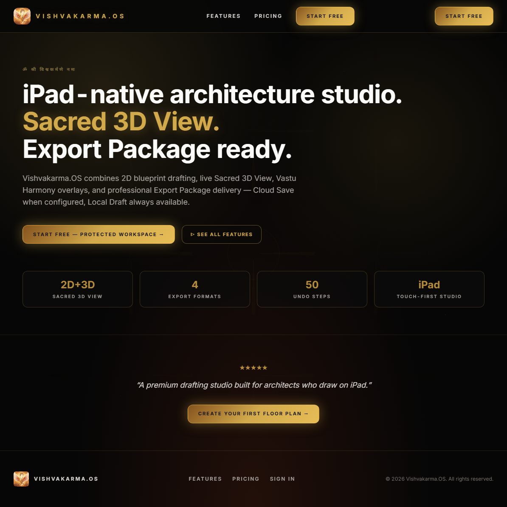

**What it does**  
The public front door. Introduces Vishvakarma.OS as an iPad-first architecture studio and routes visitors to the editor, features, or sign-in.

**What it looks like**  
A cream marketing hero with the gold “Sacred 3D View” headline, primary call-to-action buttons, metric pills (2D↔3D sync, export formats, compliance, touch targets), and a framed product showcase on the right.

**How to use it**  
Open the site root. Tap **Open Editor** (or the equivalent CTA for your sign-in state) to start drafting, or browse **Features** and **Pricing** from the header.

---

## Features

**Route:** `/features`

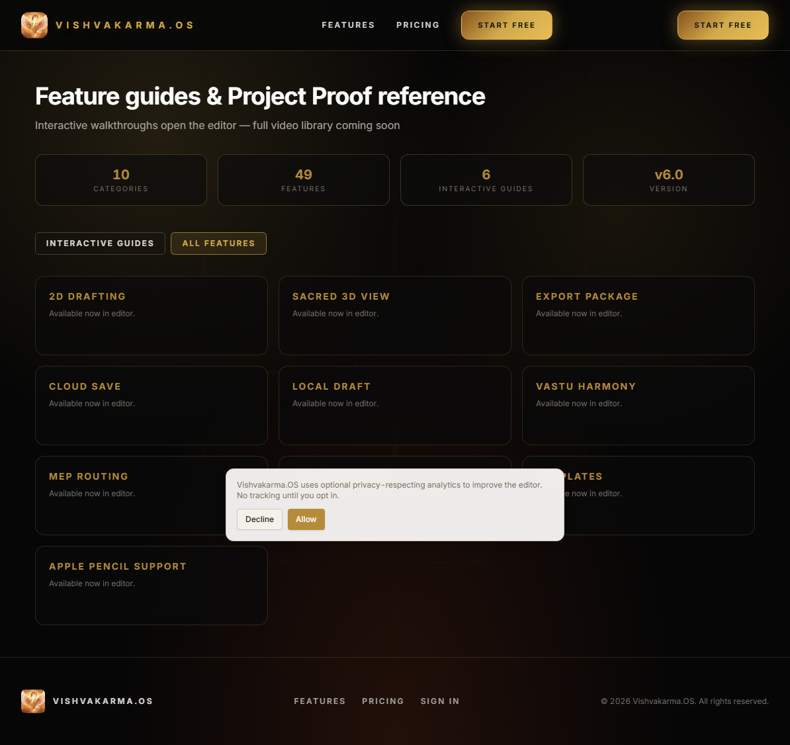

**What it does**  
Catalog of product capabilities with readiness badges (Available, Preview, Planned). Helps prospects and new users understand what the studio can do today.

**What it looks like**  
Light marketing layout with tabbed panels — **Getting Started** guides on one tab and an **All Features** grid on the other, each card showing status badges and short descriptions.

**How to use it**  
Visit `/features`. Switch tabs to read guided onboarding or scan the full feature matrix. Cards link to relevant routes (editor, governance pages) when a feature is live.

---

## Auth

**Route:** `/auth`

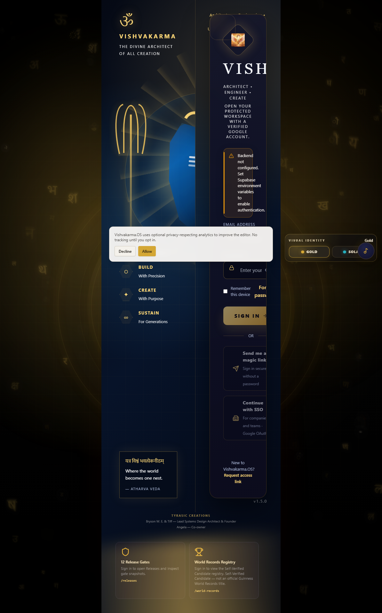

**What it does**  
Secure sign-in and account access. Connects your workspace to cloud save, billing, and governance when Supabase auth is configured.

**What it looks like**  
Centered auth card on a cream marketing backdrop — email link or OAuth options, with clear status messaging for local vs cloud mode.

**How to use it**  
Navigate to `/auth` from any “Sign in” link. Complete email magic link or Google OAuth. After sign-in you return to the editor or the page you came from.

---

## Pricing

**Route:** `/pricing` *(when enabled)*

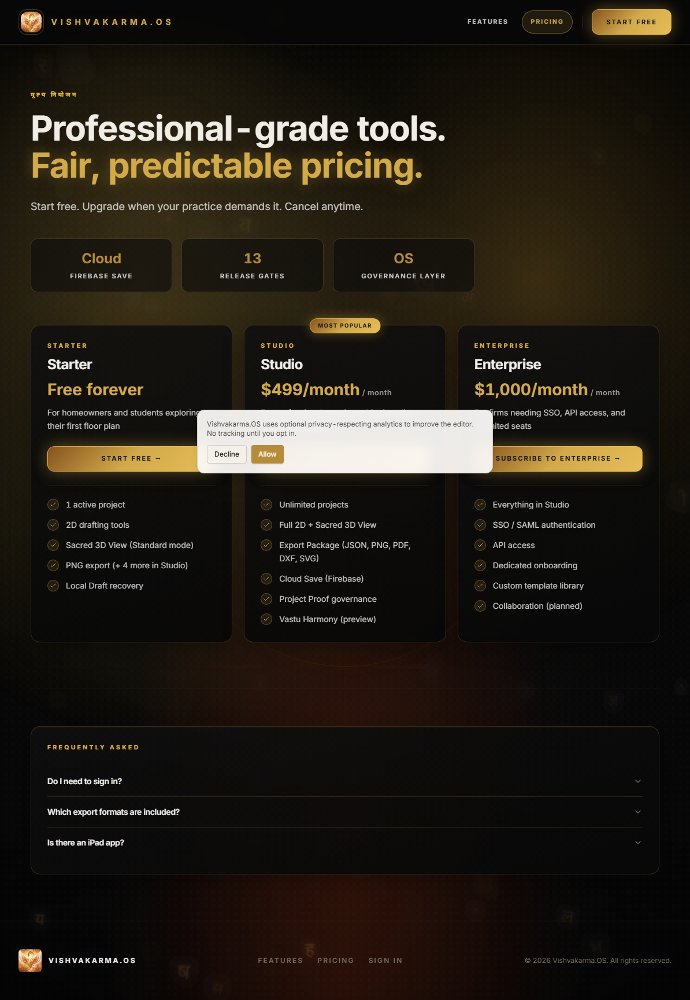

**What it does**  
Shows subscription tiers and professional tooling value props. Supports upgrade flows when Stripe billing is active.

**What it looks like**  
Marketing page with plan cards, feature comparison rows, and gold-accent CTAs on the cream background.

**How to use it**  
Open `/pricing` from the header or landing CTA. Compare plans and choose **Get started** or **Upgrade** on the tier that fits your studio.

---

## Blueprint Editor (welcome)

**Route:** `/editor` — first visit

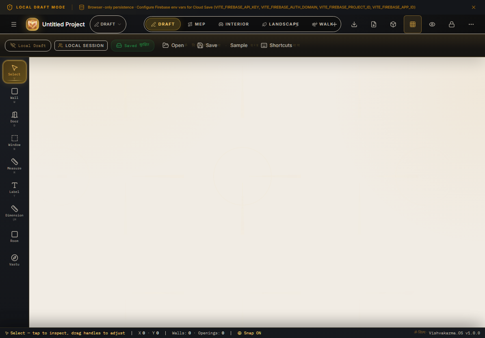

**What it does**  
Onboarding overlay for first-time editor visitors. Offers quick paths to load a sample blueprint or start drawing on an empty canvas.

**What it looks like**  
Cream editor shell dimmed behind a centered welcome card with primary actions and a short product intro.

**How to use it**  
On first open, choose **Load sample blueprint** to explore a furnished plan, or **Start drawing** to dismiss the overlay and use wall/door/window tools immediately.

---

## Blueprint Editor (2D — empty)

**Route:** `/editor`

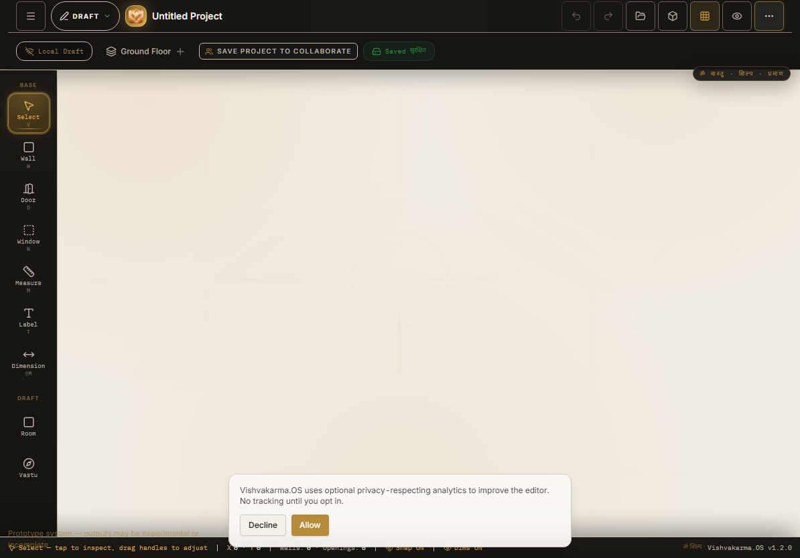

**What it does**  
The core drafting surface. Draw walls, place openings, edit properties, and sync geometry to 3D from a single floor-plan manifest.

**What it looks like**  
Cream editor chrome: left tool dock, central grid canvas, right properties panel, top project bar, and bottom status bar with coordinates and counts.

**How to use it**  
Select **Wall** (W), click-drag on the canvas to draw segments. Switch to **Door** or **Window**, click a wall to place openings. Use the properties panel for materials, dimensions, and solar settings.

---

## Blueprint Editor (2D — sample loaded)

**Route:** `/editor`

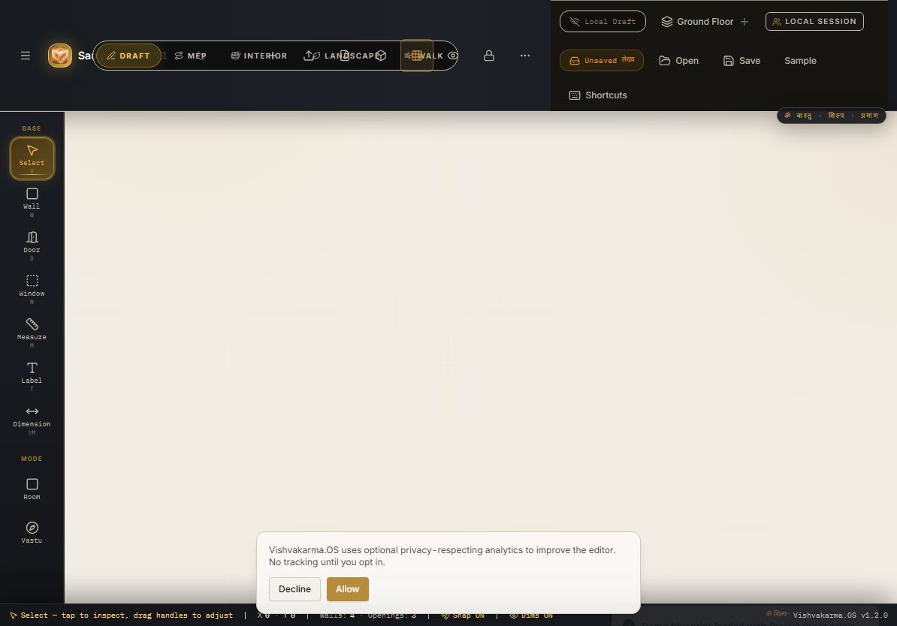

**What it does**  
Same editor with a sample house loaded — useful for demos, tutorials, and export practice without drawing from scratch.

**What it looks like**  
Populated blueprint with wall outlines, openings, and room fills on the cream canvas; status bar shows non-zero wall and opening counts.

**How to use it**  
Project menu → **Load sample blueprint** → **Load blueprint**. Pan/zoom the canvas, select elements with the **Select** tool, and edit in the properties panel.

---

## Blueprint Editor (3D — Sacred View)

**Route:** `/editor` — 3D pane

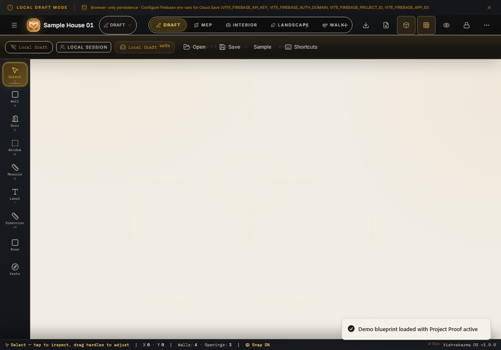

**What it does**  
Live **Sacred 3D View** extrudes walls and openings as you edit the 2D plan. Three atmosphere presets change lighting and mood for client presentations.

**What it looks like**  
Split or toggled 3D viewport beside the cream 2D canvas. **Premium** (warm sun), **Standard** (neutral), and **Cinematic** (dramatic) presets — see also `12-3d-standard.png` and `13-3d-cinematic.png`.

**How to use it**  
Tap **Toggle 3D view** in the editor top bar. Orbit with drag, pick an atmosphere chip (Premium / Standard / Cinematic). Edits on the 2D canvas update the 3D preview in real time.

---

## Export Package

**Route:** `/editor` — dialog

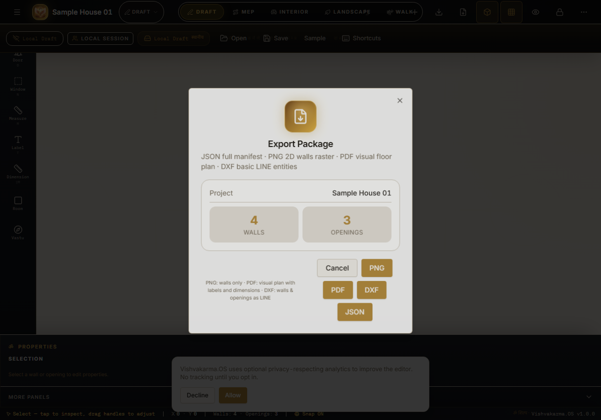

**What it does**  
Bundles the current floor plan into client-ready formats from one manifest — JSON, PNG, PDF, DXF, SVG, and related deliverables.

**What it looks like**  
Modal over the cream editor listing export formats with toggles and a download action.

**How to use it**  
Project menu → **Export**. Select formats, confirm options, and download the package for sharing or permit workflows.

---

## Projects

**Route:** `/projects`

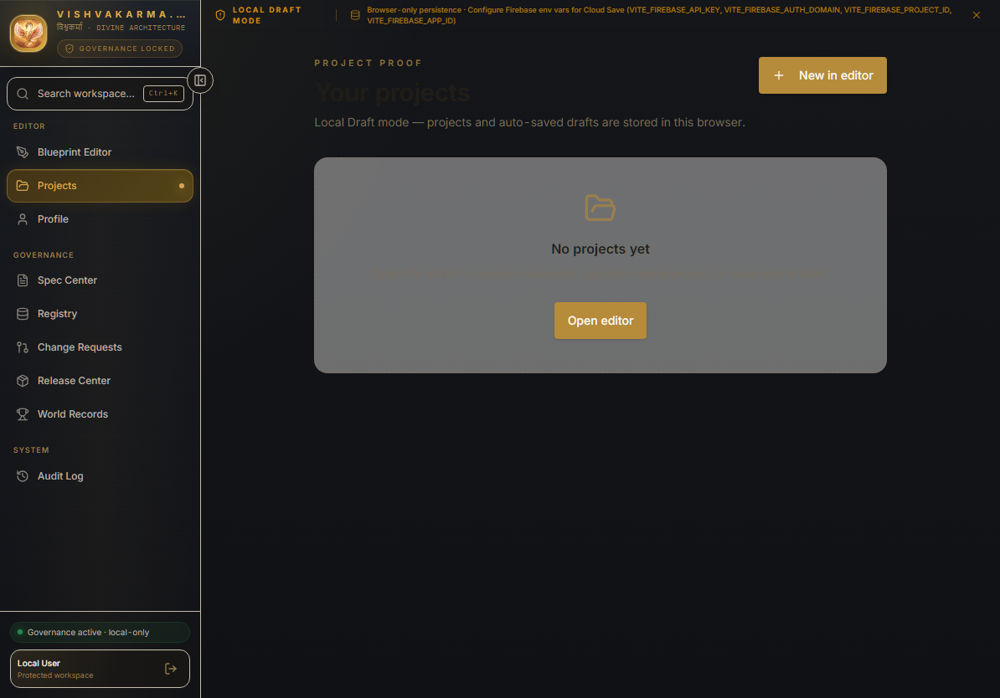

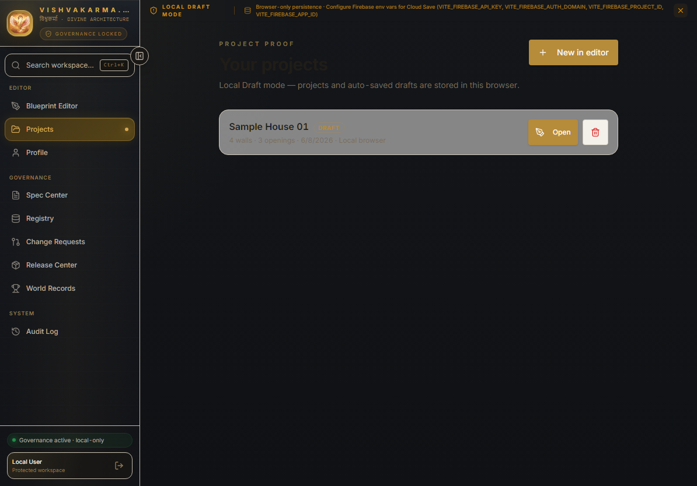

**What it does**  
Your project library — open, rename, duplicate, or delete saved floor plans. Shows local drafts and cloud projects when signed in.

**What it looks like**  
Dark workspace shell with cream content cards. Empty state prompts you to create from the editor; populated view shows thumbnails, wall/opening counts, and last-modified metadata.

**How to use it**  
Save from the editor (Project menu → **Save**), then open `/projects`. Click a card to resume editing, or use row actions to manage projects.

---

## Profile

**Route:** `/profile`

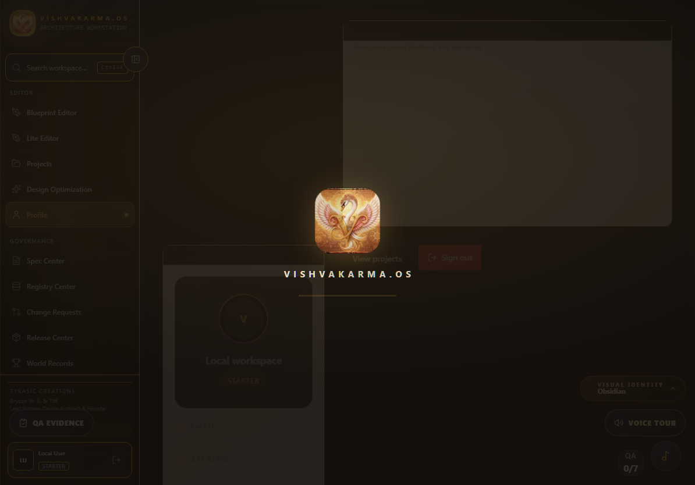

**What it does**  
Account and workspace preferences — display name, email status, billing links, and local vs cloud backend indicators.

**What it looks like**  
Dark workspace frame with profile sections in cream cards: identity, connection status, and settings rows.

**How to use it**  
Open **Profile** from the sidebar. Review signed-in identity, manage preferences, and follow links to billing or auth when cloud features are enabled.

---

## Spec Center

**Route:** `/spec-center`

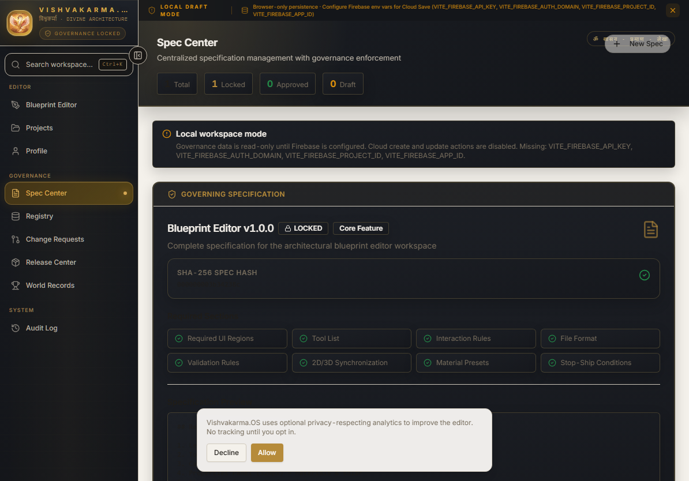

**What it does**  
Governed specification registry — locked specs with hash verification, required sections, and change accountability for release discipline.

**What it looks like**  
Dark governance layout: stat pills at top, spec cards with lock icons and verification badges, plus a backend-mode banner when running locally.

**How to use it**  
Browse locked specs, tap **View Full Spec** to read the complete document (see `24-spec-new-dialog.png`). In cloud mode, create or attest specs; locally, specs are read-only reference.

---

## Registry Center

**Route:** `/registry`

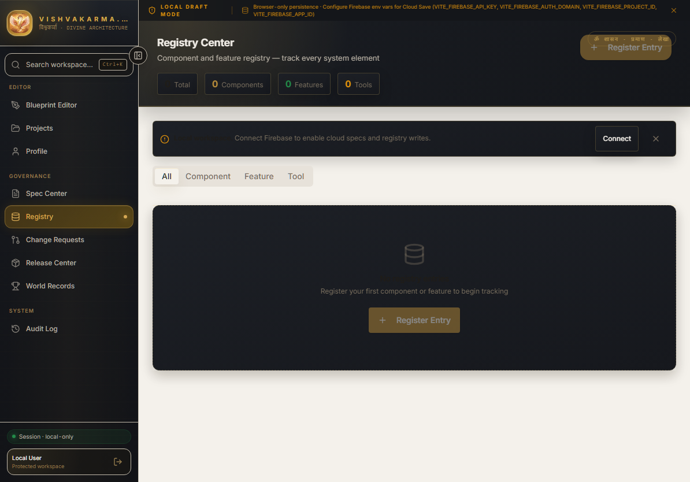

**What it does**  
Canonical registry of governed artifacts — entries tie blueprints, releases, and compliance records to traceable IDs.

**What it looks like**  
Dark governance page with registry table/cards, filter controls, and a **Register Entry** action (enabled when cloud backend is connected).

**How to use it**  
Review existing entries. When signed in with Supabase, tap **Register Entry** to record a new artifact (`26-registry-form.png` shows the local disabled state).

---

## Change Requests

**Route:** `/change-requests`

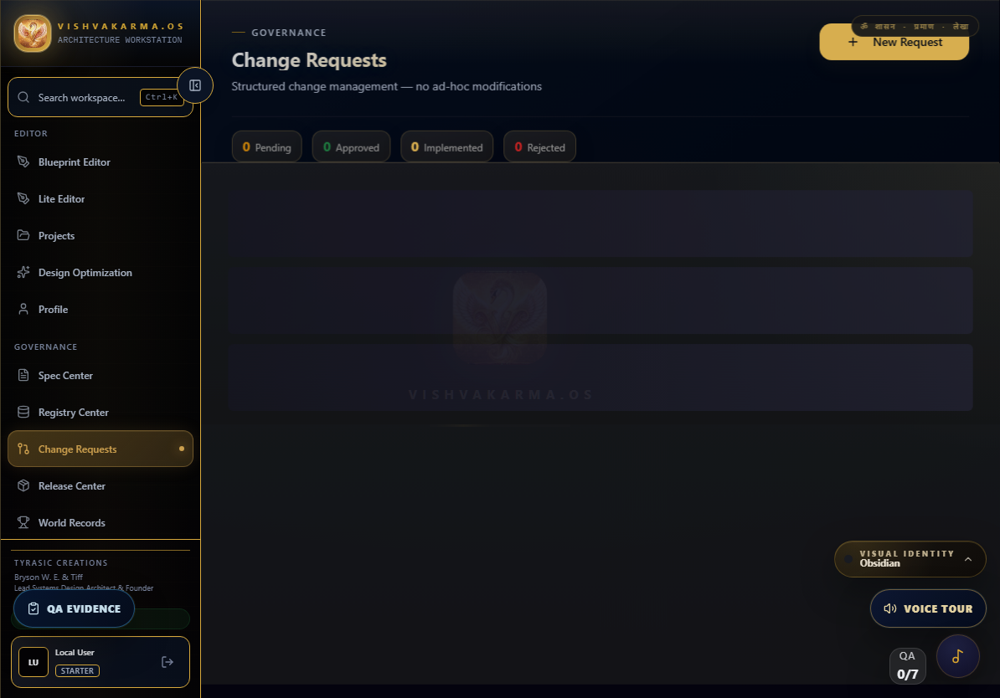

**What it does**  
Formal change-control queue — propose, review, and approve modifications to locked specs or release artifacts.

**What it looks like**  
Dark governance list with status chips, request summaries, and **New Request** CTA (cloud-enabled).

**How to use it**  
Track open requests and their disposition. Submit **New Request** when cloud auth is active to propose a governed change (`28-change-new-dialog.png`).

---

## Release Center

**Route:** `/releases`

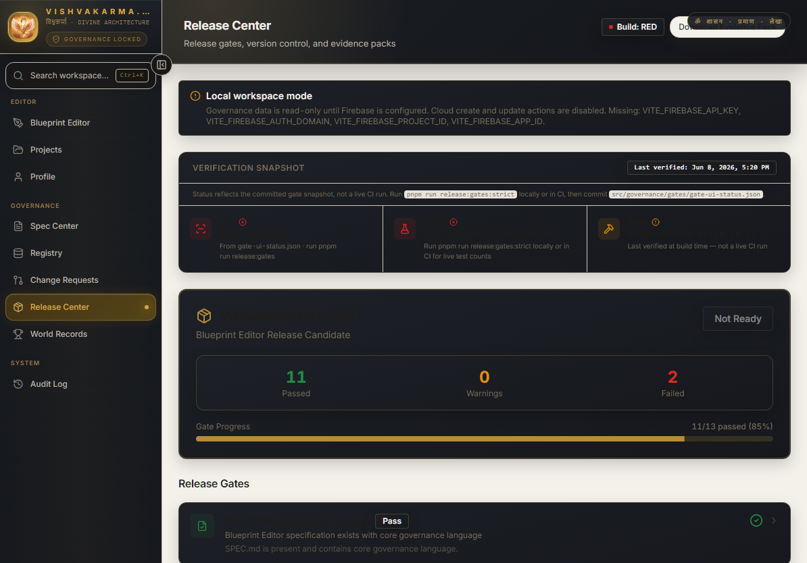

**What it does**  
Release gate dashboard — tracks release candidates, gate status, and ship/no-ship decisions across the product manifest.

**What it looks like**  
Dark governance board with release rows, gate pills (pass/fail/partial), and evidence links.

**How to use it**  
Monitor release readiness before deploy. Drill into a release row to inspect individual gates and blocking items.

---

## World Record Registry

**Route:** `/world-records`

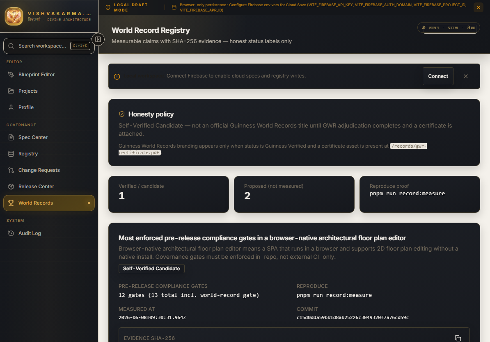

**What it does**  
Showcases notable builds and benchmark entries — community or internal “world record” plans with metadata and scores.

**What it looks like**  
Dark governance gallery/table of record entries with titles, metrics, and attribution fields.

**How to use it**  
Browse records for inspiration or compliance benchmarks. Submit entries when the registry accepts new records in your environment.

---

## Audit Log

**Route:** `/audit`

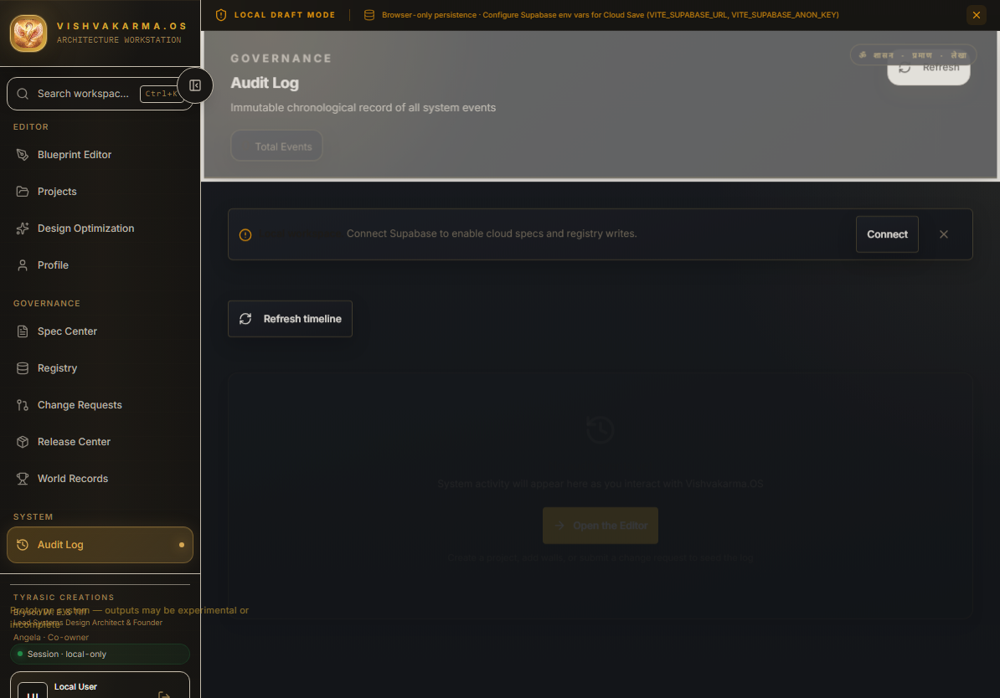

**What it does**  
Immutable activity trail for governance events — spec changes, registry actions, releases, and sign-in/security events when cloud logging is enabled.

**What it looks like**  
Dark governance timeline/table with timestamps, actors, action types, and detail snippets.

**How to use it**  
Filter or scroll the log to investigate who changed what and when. Use during release reviews or compliance audits.

---

## Design Battle (Optimization)

**Route:** `/optimization`

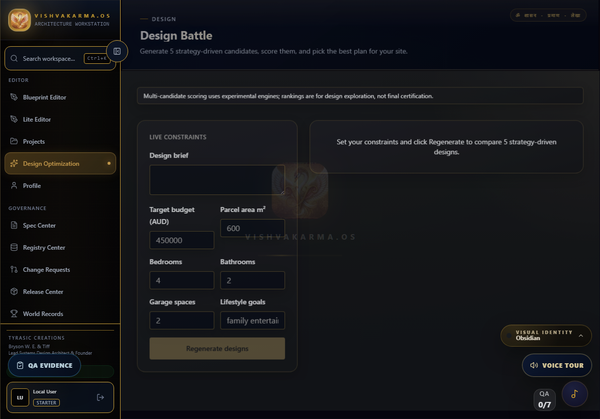

**What it does**  
AI-driven **Design Battle** — generates five strategy-driven floor-plan candidates, scores them across cost/light/compliance dimensions, and helps you pick a winner to promote into the editor.

**What it looks like**  
Dark governance shell with a constraint editor sidebar (prompt, budget, room counts) and a results pane. Empty state shows a dashed card inviting you to **Regenerate**; after a run, comparison charts and winner panels appear.

**How to use it**  
Set constraints in the left panel, click **Regenerate**, review scored candidates, favorite or compare options, then **Promote to editor** or export PDF/permit packages from the winner.

---

## Route Not Found (404)

**Route:** any unknown path

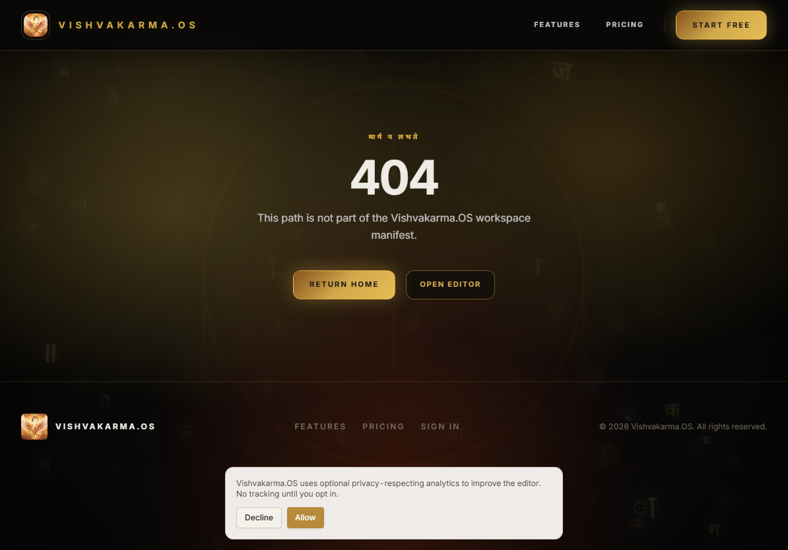

**What it does**  
Friendly dead-end handler when a URL does not match any app route.

**What it looks like**  
Compact cream marketing card with “Route not found” messaging and a link back to home or the editor.

**How to use it**  
If you land here, check the URL or use the provided link to return to `/` or `/editor`.

---

## Related packs

| Pack | Path | Command |
|------|------|---------|
| Page references (this guide) | `docs/design/page-references/` | `pnpm run capture:page-references` |
| Release evidence (marketing crop) | `docs/release/evidence/screenshots/` | `pnpm run test:screenshots` |
| Index table | [PAGE_REFERENCE.md](./page-references/PAGE_REFERENCE.md) | — |
