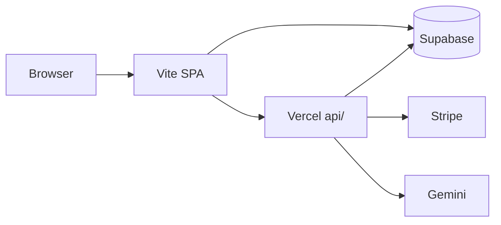

# Architecture Overview

**Product version:** v1.5.0  
**Last verified:** 2026-06-15  
**Audience:** developer  

Narrative architecture for Vishvakarma.OS. For due-diligence depth, see [handoff/03-architecture-and-data-flow.md](../handoff/03-architecture-and-data-flow.md).

**Production truth:** [CURRENT_PRODUCTION_ARCHITECTURE.md](../CURRENT_PRODUCTION_ARCHITECTURE.md)

---

## System summary

Vishvakarma.OS is a **Vite + React 18 SPA** (not Next.js) with:

- Client-side routing (React Router 7)
- Supabase for auth, Postgres/RLS, and storage
- Vercel serverless functions for Stripe billing and Gemini AI
- Three.js / React Three Fiber for live 3D

---

## Client layers

### Bootstrap

`src/main.tsx` → governance enforcer → `App.tsx` → `BrowserRouter` → `AuthProvider` → `RouteGuard` → routes

### Routing

Source of truth: `src/routes.tsx`. Live inventory: [appendix A](../handoff/appendices/A-routes-and-api.md).

Public: `/`, `/features`, `/pricing`, `/auth`  
Private (auth required): `/editor`, `/projects`, governance routes

### Persistence facade

**All UI code calls `src/db/api.ts`**, which delegates to Supabase gateways in `src/backend/supabase/`. Never import Supabase client directly from pages or components.

When Supabase is unconfigured, reads return empty arrays; writes throw. Optimization batches fall back to `localStorage`.

### Editor state

The **Project Manifest** JSON is the single source of truth for editor geometry, materials, and lighting. See [project-manifest-schema.md](../project-manifest-schema.md).

Change pipeline: `ToolRail` → `EditorPage` → `FloorPlanEngine` → manifest → `BlueprintCanvas` + `Viewport3D`

### Modules

| Module area | Location | Purpose |
|-------------|----------|---------|
| Export/import | `src/modules/export/`, `import/` | PDF, SVG, DXF, JSON |
| Compliance | `src/modules/compliance/` | NBC pre-check (decision-support) |
| Optimization | `src/services/optimization/` | Multi-candidate scoring |
| Copilot | `src/ai/` | Gemini + local parsers |
| Governance | `src/governance/` | Gates, audit, releases |

---

## Serverless API

Five production handlers in `api/`:

- `api/ai/extract-requirements.ts`
- `api/ai/parse-site-documents.ts`
- `api/stripe/create-checkout-session.ts`
- `api/stripe/create-portal-session.ts`
- `api/stripe/webhook.ts`

Details: [API.md](./API.md)

---

## Collaboration (preview)

Yjs CRDT scaffold with WebSocket presence server at `server/collab/presenceServer.ts`. Not production-complete. See [handoff/05-collaboration-preview.md](../handoff/05-collaboration-preview.md).

---

## Legacy note

Firebase artifacts remain for **migration tooling only** ([MIGRATION.md](../../MIGRATION.md)). Production runtime is Supabase-only.

---

## Related

- [DATA_MODEL.md](./DATA_MODEL.md) — Postgres and manifest
- [adr/README.md](../adr/README.md) — architecture decisions
- [handoff/02-repository-topology.md](../handoff/02-repository-topology.md) — folder layout
