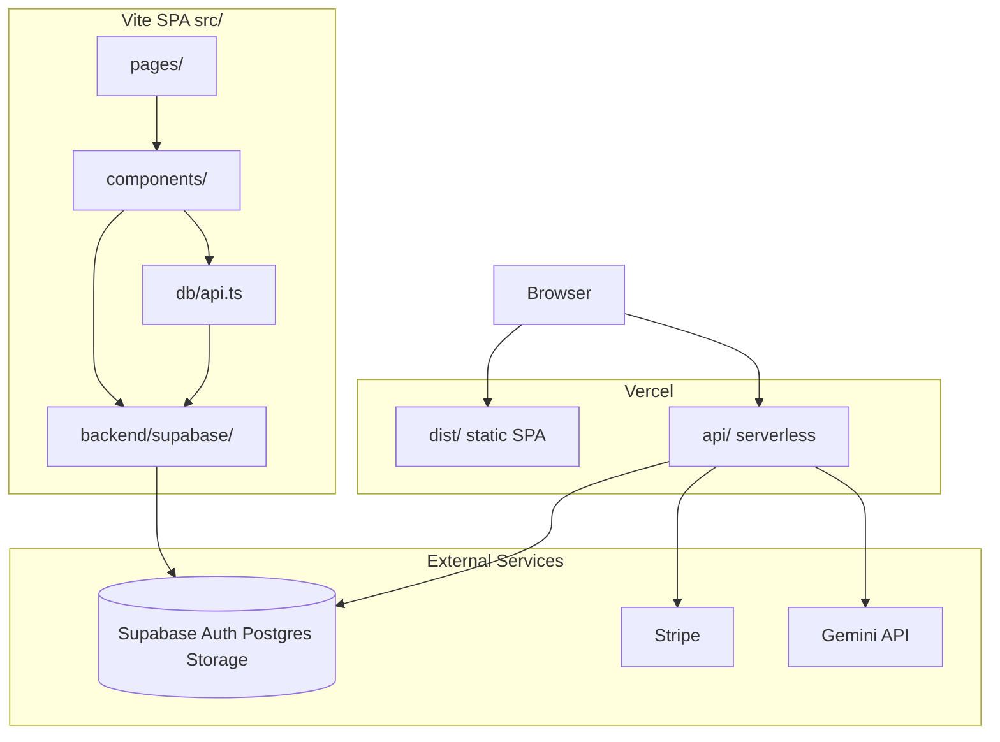

# Annex 03 — Architecture and Data Flow

[← Handoff index](./HANDOFF.md)

## High-level architecture



Canonical addendum: [`docs/CURRENT_PRODUCTION_ARCHITECTURE.md`](../CURRENT_PRODUCTION_ARCHITECTURE.md)

## Application bootstrap

[`src/main.tsx`](../../src/main.tsx):

1. Governance enforcer bootstrap (`bootstrapClientGovernanceState`, `enforce()`)
2. React render via `AppWrapper` → `App.tsx`

[`src/App.tsx`](../../src/App.tsx): `BrowserRouter` → `AuthProvider` → `RouteGuard` → `Routes`

## Provider tree

```
main.tsx
└── AppWrapper (PageMeta.tsx)
    ├── HelmetProvider
    └── TooltipProvider
        └── App.tsx
            └── BrowserRouter
                └── AuthProvider (SupabaseAuthProvider)
                    └── RouteGuard
                        ├── AppErrorBoundary → Routes
                        ├── AnalyticsConsentBanner
                        └── Toaster
```

## Backend layer (Supabase-only)

| File | Role |
|------|------|
| [`src/backend/backendConfig.ts`](../../src/backend/backendConfig.ts) | Backend detection; hardcoded Supabase path |
| [`src/backend/backendTypes.ts`](../../src/backend/backendTypes.ts) | Gateway interfaces |
| [`src/backend/supabase/createSupabaseBackend.ts`](../../src/backend/supabase/createSupabaseBackend.ts) | Gateway assembly |
| [`src/backend/supabase/supabaseClient.ts`](../../src/backend/supabase/supabaseClient.ts) | Supabase JS client |
| [`src/backend/supabase/supabaseAuthGateway.ts`](../../src/backend/supabase/supabaseAuthGateway.ts) | Email OTP, session |
| [`src/backend/supabase/supabaseOAuthGateway.ts`](../../src/backend/supabase/supabaseOAuthGateway.ts) | Google, Apple OAuth |
| [`src/backend/supabase/supabaseProjectGateway.ts`](../../src/backend/supabase/supabaseProjectGateway.ts) | Projects CRUD |
| [`src/backend/supabase/supabaseGovernanceGateway.ts`](../../src/backend/supabase/supabaseGovernanceGateway.ts) | Governance tables |
| [`src/backend/supabase/supabaseBillingGateway.ts`](../../src/backend/supabase/supabaseBillingGateway.ts) | Billing reads |
| [`src/backend/supabase/supabaseStorageGateway.ts`](../../src/backend/supabase/supabaseStorageGateway.ts) | Materials bucket uploads |

Facade: [`src/db/api.ts`](../../src/db/api.ts) — wraps gateways + audit log writes.

**Local fallback:** When Supabase env is unconfigured, drafts/projects use local storage ([`src/backend/backendConfig.ts`](../../src/backend/backendConfig.ts)).

## Serverless API

| Route | Handler |
|-------|---------|
| `POST /api/stripe/create-checkout-session` | [`api/stripe/create-checkout-session.ts`](../../api/stripe/create-checkout-session.ts) |
| `POST /api/stripe/create-portal-session` | [`api/stripe/create-portal-session.ts`](../../api/stripe/create-portal-session.ts) |
| `POST /api/stripe/webhook` | [`api/stripe/webhook.ts`](../../api/stripe/webhook.ts) |
| `POST /api/ai/extract-requirements` | [`api/ai/extract-requirements.ts`](../../api/ai/extract-requirements.ts) |
| `POST /api/ai/parse-site-documents` | [`api/ai/parse-site-documents.ts`](../../api/ai/parse-site-documents.ts) |

Shared: [`api/_lib/`](../../api/_lib/) — JWT verify, Stripe client, billing Supabase writes.

Client billing calls: [`src/services/billing/stripeCheckout.ts`](../../src/services/billing/stripeCheckout.ts).

## System module graph

[`system-map.json`](../../system-map.json) — drift detector aligned with [`src/core-contract/system.schema.ts`](../../src/core-contract/system.schema.ts).

| Module | Version | Ownership |
|--------|---------|-----------|
| ARCHITECTURE_COPILOT | 2.0.0 | `src/services/floorplan-generation/` |
| OPTIMIZATION_ENGINE | 1.3.0 | `src/services/optimization/` |
| COMPLIANCE_GATE | 1.0.0 | `src/modules/compliance/` |
| COST_INTELLIGENCE | 0.9.0 | `src/services/cost-estimation/` |
| COUNCIL_INTELLIGENCE | 1.0.0 | `src/services/council-intelligence/` |

Locked specs: [`docs/specs/`](../specs/)

## Governance enforcer

[`src/governance/core/enforcer.ts`](../../src/governance/core/enforcer.ts) — client-side spec hash verification, local governance keys, startup enforcement. Production mode is advisory at runtime; CI/release gates enforce hard checks.

## Optional collaboration server

Separate Node process — not part of default Vercel deploy:

- [`server/collab/presenceServer.ts`](../../server/collab/presenceServer.ts)
- `pnpm run collab:server:dev`

## Related appendices

- [Appendix A — Routes and API](./appendices/A-routes-and-api.md)
- [Appendix D — Database schema](./appendices/D-database-schema.md)
