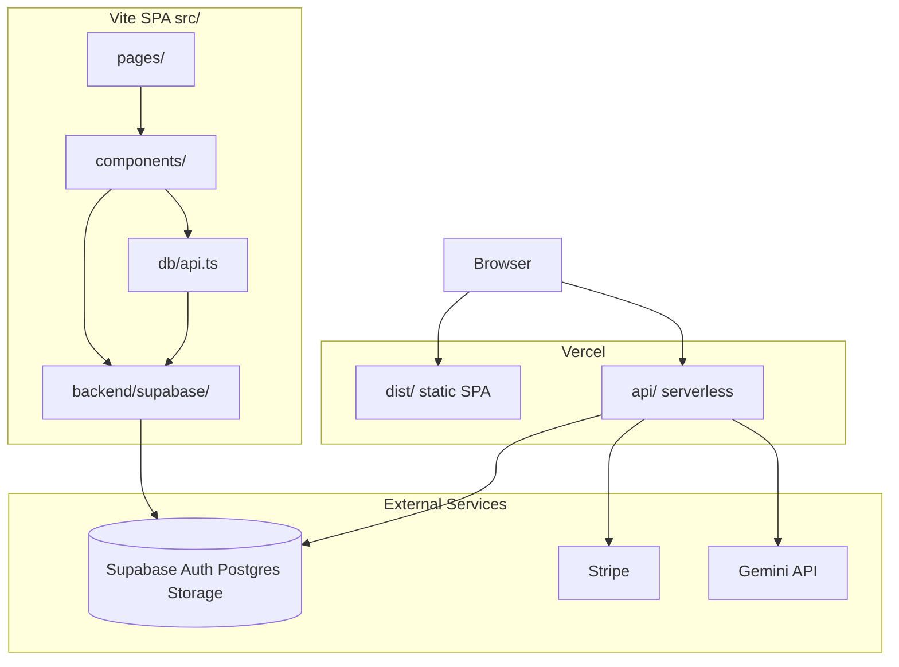

# Vishvakarma.OS — Complete Product & Codebase Handoff (v1.5.0)

**Document type:** Paste-ready context for ChatGPT and other AI assistants  
**Product version:** v1.5.0  
**Generated:** 2026-06-15  
**Git SHA:** `6cca332b31aa7fe5199c8bf809703ea03dccdd5d`  
**Canonical production URL:** https://vishvakarma-os.app  
**Vercel fallback URL:** https://vishvakarma-os.vercel.app  
**Git remote:** https://github.com/brysonandtiff-ops/vishvakarma-os.git  
**Repository root:** `vishvakarma-os-live/` (all application code lives here; parent workspace folder is a thin wrapper)

---

## How to use this document

Copy this entire file into a new ChatGPT conversation as your first message, prefixed with:

> You are helping me with Vishvakarma.OS. Here is the complete product and codebase handoff:

Then ask implementation, marketing, architecture, or due-diligence questions. This document is self-contained — you do not need to follow repo links for ChatGPT to understand the product.

---

## 1. Identity and elevator pitch

**Vishvakarma.OS** is an **iPad-first, browser-native architectural workstation** — a professional design tool delivered as a single-page web application. It combines:

1. **CAD-lite 2D drafting** — walls, openings, rooms, MEP, furniture, landscape, terrain, Vastu overlays
2. **BIM-lite live 2D→3D sync** — Three.js/React Three Fiber chamber with materials, solar lighting, walk mode, stacked multi-floor preview
3. **AI architecture copilot** — Gemini-backed requirement extraction and local floorplan generation pipeline
4. **Multi-objective design optimization** — cost, compliance, council, circulation scoring (exploratory)
5. **Rule-based compliance pre-check** — NBC India stubs, NCC stubs (decision-support only)
6. **Governance Operating System** — locked specs, registry, change requests, 13-gate releases, audit trail, world records
7. **Stripe monetization** — Starter (free), Studio ($499/mo), Enterprise ($1,000/mo)

Target users: architects, interior designers, builders, students, and project managers who need governed blueprints with export and collaboration workflows.

### What Vishvakarma.OS is NOT

- **Not Next.js** — routing is client-side React Router 7; API routes are Vercel serverless functions in `api/`, not Next.js App Router
- **Not certified for council lodgement** — compliance and council modules are simulated decision-support stubs
- **Not production-grade cost quotes** — cost intelligence uses simulated regional figures
- **Not enterprise SSO/SAML/API yet** — listed on Enterprise tier but not implemented
- **Not production real-time collaboration** — Yjs/WebSocket preview scaffold only
- **Not Firebase runtime** — Firebase artifacts remain for legacy migration/portability only; **production backend is Supabase-only**

---

## 2. Critical facts (quick reference)

| Fact | Value |
|------|-------|
| Product version | 1.5.0 |
| Canonical production URL | https://vishvakarma-os.app |
| Vercel fallback URL | https://vishvakarma-os.vercel.app |
| Supabase project ref | `jyocvwipthswfcmvqgqe` |
| Runtime backend | Supabase Auth + Postgres (RLS) + Storage |
| Billing | Stripe Checkout + Customer Portal + webhooks |
| AI | Google Gemini via `api/ai/*` (requires `GEMINI_API_KEY`) |
| Node | 20.x |
| Package manager | pnpm 9.15.0 |
| Client routes | 17 |
| Serverless API handlers | 9 |
| Postgres tables (core) | 13 |
| npm scripts | 103 |
| Unit tests (Vitest) | 119 |
| E2E specs (Playwright) | 22 |
| Release gates | 13 strict gates |

---

## 3. Feature inventory with honest status

Use these three status tiers consistently when describing the product:

| Status | Meaning | Examples |
|--------|---------|----------|
| **Production** | Shipped, CI/E2E covered, used in live app | 2D editor, 3D viewport, auth, projects, Stripe billing, governance OS, exports, marketing site, PWA |
| **Built / Prototype** | Functional but requires disclaimers; not certified | AI Designer, optimization, compliance, council intelligence, cost estimation, permit package export |
| **Preview / Planned** | Scaffold or roadmap only | Real-time collaboration (Yjs), Enterprise SSO/SAML/API, full DXF/DWG import pipeline, curved walls (RFC) |

### Production-ready features

- **2D Blueprint Editor** — wall/door/window tools, measure, label, dimension, room detection, MEP, furniture, landscape, terrain, Vastu; snap-to-grid, endpoint snap, orthogonal wall lock (Shift), wall endpoint drag, canvas zoom/pan, layer toggles, minimap, presentation mode
- **Live 3D Viewport** — real-time 2D manifest → 3D; room volume slabs, stair meshes, walk mode (Pointer Lock on desktop), solar timeline, atmosphere modes (standard/premium/cinematic), bloom postprocessing (desktop, gated), stacked multi-floor 3D with ghost lower floors
- **Projects** — cloud save via Supabase + local draft fallback when unconfigured
- **Auth** — Supabase email magic link, Google/Apple OAuth; RouteGuard on private routes
- **Exports** — JSON, SVG, PNG, PDF, DXF with tier gating; DXF import supports LINE + LWPOLYLINE
- **Stripe billing** — checkout, portal, webhooks, tier-based entitlements
- **Governance OS** — Spec Center, Registry, Change Requests, Releases, Audit Log, World Records
- **Marketing site** — landing, features, pricing (flag-gated), PWA install assets, iPad touch hardening (44px min targets)

### Built / prototype features (disclaimers required)

- **AI Architecture Copilot** — Gemini requirement extraction + local parsers; requires `GEMINI_API_KEY`; some deliverables simulated
- **Design Optimization** — multi-candidate scoring across cost/compliance/council dimensions; exploratory rankings only
- **Compliance pre-check** — NBC India stub rules (stair rise/run, ramp gradient, dead-end corridor, bedroom size); NCC stubs; not certified for council lodgement
- **Council intelligence** — approval scoring prototype
- **Cost estimation** — regional INR cost intelligence; simulated figures
- **Permit package export** — ZIP bundle from compliance paths

### Preview / planned features

- **Real-time collaboration** — Yjs CRDT bridge, WebSocket provider, remote cursors overlay; label shows "Live sync (preview)" when connected; no merge UI, no production persistence
- **Enterprise SSO/SAML/API** — on Enterprise tier marketing, not implemented
- **Full DXF/DWG pipeline** — partial (LWPOLYLINE shipped in v1.5); curved walls RFC proposed
- **Sentry monitoring** — scaffold in code, no SDK dependency

### v1.5.0 highlights (2026-06-14)

- Orthogonal wall draw lock (Shift) and wall endpoint drag with live metric length
- 2D room-type fill palette matching 3D room tints
- Stacked multi-floor 3D preview with "Stack floors" toggle
- Cinematic bloom via `postprocessing` EffectComposer (desktop, wall-count cap)
- DXF `LWPOLYLINE` import alongside LINE entities
- NBC stub rules: stair rise/run, ramp gradient, dead-end corridor
- Compliance panel category filter chips
- Blueprint canvas modularization (`blueprint/drawRooms`, `drawWalls`, `inputHandlers`)

### Verified vs partial workflows (functional proof matrix)

| Workflow | Status |
|----------|--------|
| `/auth` secure access, OAuth wiring | **PASS** |
| Unauthenticated private routes redirect to `/auth` | **PASS** |
| Authenticated app shell with official logo + navigation | **PASS** |
| All 16 routes render intended pages | **PASS** |
| 2D/3D parity for wall/opening counts | **PASS** |
| PWA install icon uses official logo | **PASS** |
| Blueprint Editor: draw wall, add opening, inspect properties | **PARTIAL** |
| Save/load/export/import preserves project data | **PARTIAL** (cloud reload needs live Supabase proof) |
| Release Center and Audit Log empty/loading states | **PARTIAL** |
| iPad/coarse-pointer controls usable | **PARTIAL** |

---

## 4. Architecture

### High-level system diagram



### System contract pipeline

The product enforces a canonical intelligence pipeline (defined in `src/core-contract/` and `system-map.json`):

```
INPUT → ARCHITECTURE_COPILOT → OPTIMIZATION → COMPLIANCE → PERMIT_EXPORT → COST/COUNCIL (read-only)
```

Enforced by `contract:gates`, ast-grep forbidden-edge rules, and regression anchor tests.

### Data flow

```
Pages/Components → db/api.ts (facade) → backend/supabase/* gateways → Supabase
                                      ↘ local storage fallback when unconfigured
Browser → Vercel API routes → Stripe / Gemini / Supabase (service role)
```

**Gateway pattern:** `src/backend/supabase/createSupabaseBackend.ts` assembles typed gateways: auth, projects, governance, billing, storage, optimization, profile.

**Route protection:** `src/components/common/RouteGuard.tsx` — client-side only; no Next.js middleware.

---

## 5. Tech stack

| Layer | Technology |
|-------|------------|
| Framework | React 18 + TypeScript 5.9 |
| Build | Vite (rolldown-vite) |
| Routing | React Router 7 (client-side SPA) |
| Styling | Tailwind CSS v3, Radix UI / shadcn-style primitives, gold "workstation" design tokens |
| 3D | Three.js, React Three Fiber, Drei, postprocessing |
| Backend / DB | Supabase Auth + Postgres (RLS) + Storage |
| Auth | Supabase email magic link, Google/Apple OAuth |
| Billing | Stripe Checkout, Customer Portal, webhooks |
| AI | Google Gemini via `@google/generative-ai` |
| Realtime (preview) | Yjs + y-websocket + optional Node collab server (`server/collab/`) |
| Hosting | Vercel (static `dist/` + serverless API routes) |
| Testing | Vitest (119 test files), Playwright (22 E2E specs) |
| Quality | Biome, tsgo, ast-grep, custom release/contract gates |
| Runtime | Node 20.x, pnpm 9.15.0 |

---

## 6. Application surface

### All 16 client routes

| Path | Page | Access | Notes |
|------|------|--------|-------|
| `/` | LandingPage | public | Marketing home |
| `/features` | FeaturesPage | public | Product catalog |
| `/pricing` | PricingPage | public | Only when `VITE_PRICING_PAGE_ENABLED=true` |
| `/auth` | AuthPage | public | Email link + Google/Apple OAuth |
| `/reset-password` | ResetPasswordPage | public | Password reset |
| `/404` | NotFoundPage | public | Branded not-found |
| `/editor` | EditorPage | private | Main 2D + 3D workspace |
| `/projects` | ProjectsPage | private | Cloud/local project library |
| `/optimization` | OptimizationPage | private | Design optimization dashboard |
| `/profile` | ProfilePage | private | Account + Stripe billing |
| `/spec-center` | SpecCenterPage | private | Locked governing specifications (SHA-256) |
| `/registry` | RegistryPage | private | Component/feature/tool registry |
| `/change-requests` | ChangeRequestsPage | private | Governed change workflow |
| `/releases` | ReleasesPage | private | 13-gate release center |
| `/world-records` | WorldRecordsPage | private | Self-verified gate-count registry |
| `/audit` | AuditLogPage | private | Governance audit timeline |

Catch-all `*` → NotFound (`src/App.tsx`).

### Editor tools (ToolRail)

| Tool | Shortcut | Notes |
|------|----------|-------|
| Select | V | Inspect, drag openings and furniture |
| Wall | W | Tap start, tap end; Shift for orthogonal lock |
| Door / Window | D / N | Snap to walls; drag along wall with % position |
| Label | T | Double-click to edit |
| Measure / Dimension | M / Shift+M | Leader lines; visibility toggle |
| Furniture | F | Drag reposition; optional GLB model body |
| MEP | — | Outlet, switch, HVAC, panel, lighting fixtures |
| Landscape / Terrain | — | Landscape elements and elevated contour patches |
| Vastu | — | 8-direction harmony overlay |

Additional editor UX: canvas zoom/pan (wheel + shift/middle pan), layer toggles (walls, rooms, furniture, MEP, Vastu), canvas minimap, presentation mode (hides tool rail), floor switcher for multi-floor projects, room type picker, properties panel with metric/imperial dimensions.

---

## 7. Billing, roles, and disclaimers

### Pricing tiers

| Tier | Price | Trial | Self-serve checkout | Highlights |
|------|------:|-------|---------------------|------------|
| **Starter** | Free | — | No | 1 project, 2D tools, PNG export, local draft |
| **Studio** | $499/mo | 14 days | Yes | Unlimited projects, full 3D, all export formats, cloud save, governance, Vastu/NBC |
| **Enterprise** | $1,000/mo | — | Yes | Studio + SSO/SAML, API, dedicated onboarding (**collaboration planned**) |

Stripe price IDs verified at 49900 and 100000 cents respectively.

### Export tier resolution (`resolveExportTier`)

- Unconfigured backend (local dev): **Studio** tier
- Signed out: **Starter**
- Co-owner allowlisted emails: **Enterprise**
- Active/trialing Studio or Enterprise billing: respective tier
- Default signed-in user: **Starter**

Export formats: JSON (Studio+, full manifest round-trip), SVG, PNG, PDF, DXF (tier-gated), ZIP permit package (compliance-gated).

### Platform roles (`profiles.role`)

- `user` — default
- `admin` — governance writes (specs, registry, releases)

### Project member roles (8 roles)

| Role | Summary |
|------|---------|
| `owner` | Full control including billing and delete |
| `co_owner` | Design, members, governance — no billing/delete |
| `architect` | Edit, AI designer, optimization, exports |
| `builder` | Export, compliance, construction docs |
| `engineer` | Compliance review, construction docs |
| `family` | View + comment |
| `council_reviewer` | View, comment, council/compliance review |
| `viewer` | Read-only |

Co-owner allowlist (`src/config/coOwners.ts`): specific emails receive enterprise entitlements and admin governance access without a Stripe subscription.

### Prototype disclaimers (must not market as certified)

- **Cost intelligence** — "Early-stage cost engine. Figures are simulated for design validation and may not reflect final production-grade pricing."
- **Compliance** — "Automated NCC stub checks — simulated compliance layer, not certified for council lodgement."
- **Copilot** — "Experimental computation layer. Some deliverables are simulated or partially implemented."
- **Optimization** — "Multi-candidate scoring uses experimental engines; rankings are for design exploration, not final certification."

---

## 8. Data model summary

### Postgres tables (`public` schema)

1. `profiles` — user accounts, platform role
2. `projects` — project metadata + JSONB manifest
3. `specs` — locked governing specifications
4. `registry` — component/feature/tool registry
5. `change_requests` — governed change workflow
6. `releases` — gate-checked release records
7. `audit_logs` — system event timeline
8. `route_manifest` — navigation manifest
9. `billing` — Stripe subscription state per user
10. `optimization_batches` — optimization run history

Additional: `collaborators` table and `materials` storage bucket (migration 20260213000005).

RLS policies enforce: users see own projects/billing; admins write governance tables; project members can read/update shared projects.

### Project Manifest (application state)

Stored as JSONB in `projects.manifest`. Core fields:

- `walls[]` — id, start/end Point2D, thickness, height, material, floorIndex
- `openings[]` — id, type (door/window), wallId, position (0-1), width, height, sillHeight
- `rooms[]` — detected polygons with roomType, floorIndex, labels
- `floors[]` — multi-floor scaffold
- `furniture[]`, `mep[]`, `landscape[]`, `terrain[]`, `staircases[]` — floor-scoped fixtures
- `materials[]`, `lighting`, `gridSize`, `snapToGrid`, `camera` (viewport persistence)
- `metadata` — created, modified, author

Single source of truth: changes to 2D canvas update manifest; 3D viewport reads same manifest in real time.

---

## 9. API endpoints (Vercel serverless)

| HTTP | Handler | Purpose |
|------|---------|---------|
| `POST /api/stripe/create-checkout-session` | `api/stripe/create-checkout-session.ts` | Start Stripe Checkout for Studio/Enterprise |
| `POST /api/stripe/create-portal-session` | `api/stripe/create-portal-session.ts` | Customer billing portal |
| `POST /api/stripe/webhook` | `api/stripe/webhook.ts` | Subscription lifecycle webhooks |
| `POST /api/ai/extract-requirements` | `api/ai/extract-requirements.ts` | Gemini requirement extraction from user input |
| `POST /api/ai/parse-site-documents` | `api/ai/parse-site-documents.ts` | Gemini document parsing for site constraints |

Shared API libraries: `api/_lib/stripeClient.ts`, `billingSupabase.ts`, `verifySupabaseToken.ts`, `verifyAuthToken.ts`.

Server-only env: `STRIPE_SECRET_KEY`, `STRIPE_WEBHOOK_SECRET`, `STRIPE_PRICE_STUDIO_MONTHLY`, `STRIPE_PRICE_ENTERPRISE_MONTHLY`, `GEMINI_API_KEY`, `SUPABASE_SERVICE_ROLE_KEY`.

Client env: `VITE_SUPABASE_URL`, `VITE_SUPABASE_ANON_KEY`, `VITE_AUTH_REDIRECT_ORIGIN`, `VITE_PRICING_PAGE_ENABLED`, `VITE_COLLAB_WS_URL` (optional).

---

## 10. Repository map

```
vishvakarma-os-live/
├── src/
│   ├── components/editor/     2D/3D editor UI (BlueprintCanvas, Viewport3D, ToolRail, panels)
│   ├── pages/                 Route pages (EditorPage, governance pages, marketing)
│   ├── core/                  floorPlanEngine, exporters (SVG/PNG/PDF/DXF), importers
│   ├── backend/supabase/      Production backend gateways (auth, projects, billing, governance)
│   ├── db/api.ts              Persistence facade used by all pages
│   ├── services/              cost, council, copilot, optimization, floorplan-generation
│   ├── modules/               export, import, compliance, optimization, permit, governance
│   ├── governance/            Release gates, records, snapshots, enforcer
│   ├── ai/building-designer/  Architecture Copilot orchestrator and generators
│   ├── collaboration/       Yjs CRDT bridge, WebSocket provider (preview)
│   ├── rules/                 NBC India, NCC, zoning, accessibility, fire, energy
│   ├── config/                billingPlans, appVersion, coOwners, marketingFeatures
│   └── routes.tsx             All 16 client routes
├── api/                       Vercel serverless (Stripe, Gemini)
├── server/collab/             Optional Yjs WebSocket server (port 1234)
├── supabase/migrations/       5 Postgres migrations
├── scripts/
│   ├── quality/               contract, auth, hardening, launch evidence gates
│   ├── handoff/               generate-handoff-appendices.mjs
│   └── production/            evidence generation, functional proof
├── e2e/                       20 Playwright specs
├── docs/                      specs, handoff, release evidence
└── public/                    PWA assets, GLB models, sample manifests
```

### Key entry files

| File | Purpose |
|------|---------|
| `src/routes.tsx` | All client routes and access levels |
| `src/pages/EditorPage.tsx` | Main 2D + 3D workspace orchestration |
| `src/core/floorPlanEngine.ts` | Manifest-driven floor plan state and history |
| `src/components/editor/BlueprintCanvas.tsx` | 2D canvas rendering and input |
| `src/components/editor/Viewport3D.tsx` | 3D chamber (R3F) |
| `src/db/api.ts` | Unified persistence facade |
| `src/backend/supabase/createSupabaseBackend.ts` | Gateway assembly |
| `src/config/billingPlans.ts` | Tiers and export entitlements |
| `src/governance/core/enforcer.ts` | Client-side governance enforcement at startup |
| `src/constants/prototypeDisclaimer.ts` | Prototype module disclaimer strings |

---

## 11. Governance model

Vishvakarma.OS embeds a **Governance Operating System** inside the product — not just CI checks, but user-facing pages:

| Module | Route | Purpose |
|--------|-------|---------|
| Spec Center | `/spec-center` | Locked specifications with SHA-256 hash verification |
| Registry | `/registry` | Component, feature, and tool inventory |
| Change Requests | `/change-requests` | Structured change workflow before releases |
| Release Center | `/releases` | 13-gate release pipeline with evidence packs |
| World Records | `/world-records` | Self-verified gate-count measurement artifact |
| Audit Log | `/audit` | Chronological event timeline for all system actions |

**13 release gates** enforced by `pnpm run release:gates` (`scripts/verify-all.js`):

Categories include: lint/types, system contract, forbidden edges, auth config, production hardening, PWA assets, project roles, launch evidence, unit tests, route smoke, build, E2E gates, world record measurement.

Gate 13 requires a machine-readable world-record artifact: `pnpm run record:measure`.

Governance writes require `profiles.role = admin`. Client enforcer runs at app startup; CI/release gates do hard enforcement.

Locked governing specs live in `docs/specs/`: SYSTEM_CONTRACT_LAYER, ARCHITECTURE_COPILOT_v2, PLANNING_INTELLIGENCE_v1, DESIGN_OPTIMIZATION_ENGINE, CONSTRUCTION_COST_INTELLIGENCE, COUNCIL_INTELLIGENCE, NBC_INDIA_PRECHECK_v1, VASTU_HARMONY_v1, PROJECT_ROLES_AND_PERMISSIONS.

---

## 12. What is NOT built (common misconceptions)

1. **Real-time collaboration** — Yjs CRDT + WebSocket scaffold exists; remote cursors show when connected; no merge conflict UI, no guaranteed cross-session persistence; header shows "Live sync (preview)". Local setup: run collab server on port 1234, set `VITE_COLLAB_WS_URL` optionally.

2. **Enterprise SSO/SAML/API** — marketed on Enterprise tier ($1,000/mo) but not implemented in code.

3. **Firebase as production backend** — Firebase migration scripts and export utilities remain for archive/portability. Current production path is Supabase-only. Do not describe Firebase as the live runtime.

4. **Certified compliance or council approval** — NBC/NCC rules are stub checks for design exploration. Do not claim lodgement-ready or council-certified output.

5. **Production cost quotes** — cost intelligence uses simulated regional figures for design validation.

6. **Full DXF/DWG import** — LINE and LWPOLYLINE supported in v1.5; full pipeline and curved walls are RFC backlog.

7. **Sentry/error monitoring** — scaffold references exist; no Sentry SDK dependency installed.

---

## 13. Truth hierarchy for AI assistants

When documents or user statements conflict, use this precedence:

1. **This document** + `docs/CURRENT_PRODUCTION_ARCHITECTURE.md`
2. `docs/SOFTWARE_INVENTORY.md`, `docs/PRODUCT_CAPABILITIES.md`
3. Auto-generated `docs/handoff/appendices/` (regenerate: `pnpm run handoff:generate`)
4. `README.md`, `docs/README.md`
5. Historical step/build docs (`STEP*_*.md`, `tasks/VISHVAKARMA_OS_BUILD_DOCUMENT.md`) — **lowest precedence**

Version source of truth: `package.json` and `src/config/appVersion.ts` (both say **1.5.0**).

---

## 14. Verification commands

### Daily development

```bash
cd vishvakarma-os-live
pnpm install --frozen-lockfile
cp .env.example .env.local
pnpm run dev
```

### Core verification

```bash
pnpm run lint:types          # tsgo app + api
pnpm run hardening:gates
pnpm run auth:gates
pnpm run verify:supabase-schema
pnpm run verify:production-auth-flow
pnpm run verify:stripe-billing
pnpm run test
pnpm run build
pnpm run verify:ci           # lint + contract + auth + flawless + evidence + test + build + routes
pnpm run release:gates       # 13 strict release gates
```

### Handoff regeneration

```bash
pnpm run handoff:generate    # Refresh appendices A–H + MANIFEST.json from live code
pnpm run handoff:verify        # Confirm all annexes and appendices present
```

### Backend setup

```bash
pnpm run setup:supabase-auth
pnpm run setup:supabase-auth:full
pnpm run setup:stripe
pnpm run verify:stripe-billing
pnpm run collab:server:dev     # Local Yjs preview server :1234
```

---

## 15. Design system and brand

Vishvakarma.OS uses a **gold workstation** visual language:

- Always-dark editor chrome and drafting canvas
- Light governance panels
- Metallic gold primary accents (`#CF9B3A` snap rings, gold window frames)
- Minimum 44×44 px touch targets for iPad
- Semantic CSS tokens only (no raw hex in components)
- Devanagari/Sanskrit-inspired brand layers on marketing/auth surfaces
- Official logo enforced on AuthPage, AppLayout, PWA manifest, apple-touch-icon

Browser support: Chrome/Edge 90+, Firefox 88+, Safari/iOS 14+. WebGL 2 preferred; WebGL 1 fallback; graceful 2D-only degradation if no WebGL.

---

## 16. Deeper reading (optional — not required for ChatGPT context)

These repo files contain extended detail if a human operator needs them:

- `docs/handoff/HANDOFF.md` — master index for valuation/due diligence (10 annexes + appendices A–H)
- `docs/CURRENT_PRODUCTION_ARCHITECTURE.md` — Supabase production addendum
- `docs/SOFTWARE_INVENTORY.md` — deep technical inventory
- `docs/PRODUCT_CAPABILITIES.md` — audited feature brief
- `docs/handoff/05-collaboration-preview.md` — collaboration preview limitations
- `docs/release/VERIFY_COMMANDS.md` — full verification command matrix
- `docs/release/VERCEL_ENV.md` — complete env var matrix
- `CHANGELOG.md` — version history v1.0 through v1.5.0

---

## Footer

**End of handoff.** You now have accurate v1.5.0 context for Vishvakarma.OS.

- Product: iPad-first browser architectural workstation with 2D/3D editor, AI copilot, optimization, compliance decision-support, Governance OS, and Stripe billing
- Stack: React 18 + Vite + React Router 7 + Three.js + Supabase + Stripe + Gemini on Vercel
- Production: editor, 3D, auth, billing, governance, exports
- Prototype: AI, optimization, compliance, cost, council (disclaimers required)
- Preview/planned: collaboration, Enterprise SSO/API, full DXF pipeline
- Git SHA: `6cca332b31aa7fe5199c8bf809703ea03dccdd5d`
- Generated: 2026-06-15

Safe to ask questions about implementation, features, architecture, marketing claims, or due diligence.
