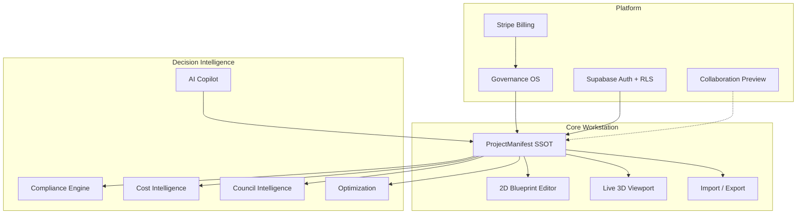

# Vishvakarma.OS — World-Class Architecture Software Master Plan

**Version:** v1.5.0 baseline → v2.x horizon  
**Last updated:** 2026-06-15  
**Status:** Active strategic plan (implementation tracked in RFCs and release gates)

---

## North star

**Vishvakarma.OS is the iPad-first, browser-native architectural workstation** where design, governance, optimization, and decision-support intelligence share a single source of truth: the **ProjectManifest**.

Positioning: not a CAD clone — a **Governance OS for architecture** that ships faster than desktop suites on tablet hardware, with AI-native workflows and auditable release discipline.

Production URL: https://vishvakarma-os.app

---

## Five strategic moats

| Moat | What it means | v1.5 evidence |
|------|---------------|---------------|
| **Governance OS** | Spec locking, change requests, 13-gate release pipeline, evidence packs | `src/governance/`, Release Center |
| **AI-native** | Gemini copilot, concept design, council/cost intelligence (decision-support) | `api/ai/*`, copilot modules |
| **iPad-first** | Touch targets, PWA shell, coarse-pointer 3D, safe-area hardening | iPad audit evidence |
| **Optimization** | Batch runs, scoring, manifest-linked recommendations | `src/domain/optimization/` |
| **Decision-support** | Compliance, council, cost — prototype disclaimers, export gates | `src/modules/compliance/` |

All intelligence outputs remain **decision-support only** until certified integrations (NCC library, council APIs, quantity surveyor feeds).

---

## Product pillars

---

## Gap analysis (v1.5.0 → world-class)

| Gap | Current | Target | Epic |
|-----|---------|--------|------|
| Real-time collaboration | Yjs preview scaffold | Production CRDT + presence + permissions | [RFC 007](../rfc/007-production-collaboration.md) |
| BIM depth | Manifest walls/openings/rooms | Typed building graph, schedules, IFC path | [RFC 006](../rfc/006-bim-graph-layer.md) |
| DXF/DWG/IFC | LINE + LWPOLYLINE client import | Layer mapping, DWG server pipeline, IFC read | [RFC 002](../rfc/002-dxf-import.md) |
| Compliance | AU NCC + IN NBC stubs | Jurisdiction rule packs with citations | [RFC 009](../rfc/009-compliance-jurisdiction-v1.md) |
| Sheet sets | Single-page PDF/SVG export | Multi-sheet composer, elevations | [RFC 008](../rfc/008-sheet-set-export.md) |
| Curved walls | Rectilinear only | Bézier wall segments | [RFC 001](../rfc/001-curved-walls.md) |
| Enterprise | SSO/API planned | SAML, REST project API | Billing roadmap |
| Monitoring | Sentry scaffold | Production error + perf telemetry | Operations backlog |

---

## 36-month phased roadmap

### Horizon 0 — Foundation (months 0–6, **now**)

- Ship world-class plan + epic RFCs (this document)
- Compliance v1 rule packs with citations (AU NCC Vol 2 H-class)
- BIM graph v0 adapter (manifest → typed elements, no editor break)
- DXF import v1.5+ (layer mapping, import preview warnings)
- Sheet set export scaffold (composer API + tests)
- Extend quality gates 14–18 (see below)

### Horizon 1 — Depth (months 6–18)

- Production collaboration (WebSocket relay, RLS project roles)
- Sheet set v1: plan + elevation auto-generation, PDF multi-page
- DWG import via server conversion pipeline
- NBC/India rule pack parity with AU citations
- Curved walls RFC implementation (schema v1.2+)
- IFC export read path (walls/slabs)

### Horizon 2 — Scale (months 18–30)

- Enterprise SSO/SAML, project REST API
- Certified NCC clause library integration (partner/legal review)
- Council jurisdiction packs (AU states)
- Full IFC 4 import/export subset
- Multi-discipline MEP graph layer
- Sentry + RUM production monitoring

### Horizon 3 — Category leadership (months 30–36)

- AR preview (re-file RFC if revived)
- Marketplace for rule packs and templates
- Offline-first iPad sync
- World-record measurable claims backed by gate evidence

---

## 90-day critical path (Q3 2026)

| Week | Deliverable | Owner surface |
|------|-------------|---------------|
| 1–2 | Master plan + RFC 006–009 stubs | `docs/roadmap/`, `docs/rfc/` |
| 2–4 | Compliance AU rule pack + cited findings | `src/modules/compliance/rulePacks/` |
| 3–5 | BIM graph v0 + manifest adapter tests | `src/domain/buildingGraph/` |
| 4–6 | DXF layer mapping + import stats | `src/core/importers/dxfImport.ts` |
| 5–7 | Sheet set composer scaffold | `src/modules/sheetSet/` |
| 6–8 | Gate 14–15 automation hooks | `src/governance/gates/` |
| 8–10 | Collaboration RFC spike (read-only presence) | `src/collaboration/` |
| 10–12 | Sheet set v1 alpha (plan + one elevation) | export module |

**Exit criteria for 90 days:** lint + unit tests green; compliance findings show citations; building graph adapter round-trips manifest counts; DXF import reports layer summary; sheet set stub produces page manifest JSON.

---

## Quality gates extension (14–18)

Existing gates 1–13 remain authoritative per [ADR-004](../adr/004-thirteen-gate-release-pipeline.md). World-class releases add:

| Gate | Name | Category | Evidence / command |
|------|------|----------|-------------------|
| **14** | Compliance rule pack integrity | automated-strict | Rule pack registry matches active jurisdiction rules; Vitest `rulePacks/*.test.ts` |
| **15** | BIM graph adapter parity | automated-strict | `manifestToBuildingGraph` wall/opening/room counts match manifest |
| **16** | DXF import regression | automated-strict | Fixtures: LINE, LWPOLYLINE, layer-filtered DXF |
| **17** | Sheet set composer scaffold | automated | Composer produces ≥1 sheet page descriptor from sample manifest |
| **18** | Decision-support disclaimer present | automated | Compliance/council/cost exports include prototype disclaimer string |

Gates 14–18 are **documented targets** for v1.6+; wire into `gate-manifest.json` when each deliverable ships.

---

## Related documents

- [PRODUCT_CAPABILITIES.md](../PRODUCT_CAPABILITIES.md) — audited feature brief
- [handoff/10-ip-risks-roadmap-and-gaps.md](../handoff/10-ip-risks-roadmap-and-gaps.md) — valuation gaps
- [RFC backlog](../rfc/README.md) — pre-implementation specs
- [CURRENT_PRODUCTION_ARCHITECTURE.md](../CURRENT_PRODUCTION_ARCHITECTURE.md) — Supabase production path
- [v2/ARCHITECTURE.md](../v2/ARCHITECTURE.md) — forward-looking (not production claims)

---

## Maintenance

- Update this plan when an epic RFC moves to **Accepted** or **Shipped**
- Run `pnpm run docs:verify` after doc changes
- Link new RFCs in [docs/rfc/README.md](../rfc/README.md)
