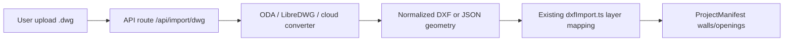

# DWG Import Pipeline — Spike Notes

**Status:** Spike (Horizon 1) — not production-ready  
**RFC:** [002-dxf-import.md](../rfc/002-dxf-import.md)  
**Date:** 2026-06-15

## Problem

DWG is the de facto CAD exchange format for consultants. Client-side parsing is impractical; v1.5 only supports DXF LINE/LWPOLYLINE import.

## Recommended pipeline (server-side)

## Spike findings

| Option | Pros | Cons |
|--------|------|------|
| **LibreDWG → DXF** (server) | Reuses `dxfImport.ts`; no browser deps | License/hosting; conversion latency |
| **ODA File Converter** | Industry standard output | Commercial terms; ops burden |
| **Cloud API** (Autodesk Platform Services) | Managed scale | Cost; OAuth; data residency |
| **Client WASM** | No server | Large bundle; incomplete DWG support |

## Minimal v1 scaffold (deferred)

If implemented in Horizon 1, scope to:

1. `POST /api/import/dwg` — auth + size cap (e.g. 5 MB)
2. Temp storage → convert → return DXF string
3. Client calls existing `importDxfToManifest` with layer map UI
4. Vitest fixture: converted sample DWG → manifest wall count > 0

## Non-goals (this spike)

- Full layer/style preservation
- Block references and xrefs
- Real-time DWG sync

## Exit criteria for production DWG

- [ ] Server converter deployed with audit log
- [ ] RLS-scoped upload; virus scan hook
- [ ] DXF regression gate 16 still green on converted fixtures
- [ ] Prototype disclaimer on import preview UI

## References

- `src/core/importers/dxfImport.ts`
- `docs/roadmap/WORLD_CLASS_PLAN.md` — Horizon 1 DWG import
- `docs/rfc/008-sheet-set-export.md` — sheet output path after geometry import
